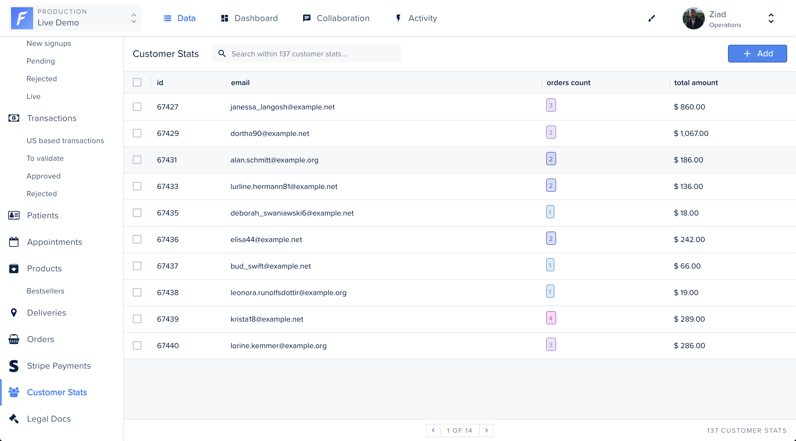


Please be sure of your agent type and version and pick the right documentation accordingly.





This is the documentation of the `forest-express-sequelize` and `forest-express-mongoose` Node.js agents that will soon reach end-of-support.

`forest-express-sequelize` v9 and `forest-express-mongoose` v9 are replaced by [`@forestadmin/agent`](https://docs.forestadmin.com/developer-guide-agents-nodejs/) v1.

Please check your agent type and version and read on or switch to the right documentation.





This is still the latest Ruby on Rails documentation of the `forest_liana` agent, you’re at the right place, please read on.





This is the documentation of the `django-forestadmin` Django agent that will soon reach end-of-support.

If you’re using a Django agent, notice that `django-forestadmin` v1 is replaced by [`forestadmin-agent-django`](https://docs.forestadmin.com/developer-guide-agents-python) v1.

If you’re using a Flask agent, go to the [`forestadmin-agent-flask`](https://docs.forestadmin.com/developer-guide-agents-python) v1 documentation.

Please check your agent type and version and read on or switch to the right documentation.





This is the documentation of the `forestadmin/laravel-forestadmin` Laravel agent that will soon reach end-of-support.

If you’re using a Laravel agent, notice that `forestadmin/laravel-forestadmin` v1 is replaced by [`forestadmin/laravel-forestadmin`](https://docs.forestadmin.com/developer-guide-agents-php) v3.

If you’re using a Symfony agent, go to the [`forestadmin/symfony-forestadmin`](https://docs.forestadmin.com/developer-guide-agents-php) v1 documentation.

Please check your agent type and version and read on or switch to the right documentation.




# Manage SQL views

In SQL, a view is a virtual table based on the result-set of an SQL statement. Views can provide advantages over tables, such as:

- represent a subset of the data contained in a table (see also[ segments](https://docs.forestadmin.com/user-guide/collections/segments)).
- join and simplify many tables into a single virtual table.
- act as aggregated tables, where the database engine aggregates data (sum, average etc.) and presents the calculated results as part of the data.


Forest Admin natively supports SQL views. If you have already implemented views, simply add [the associated models](https://docs.forestadmin.com/documentation/reference-guide/models/enrich-your-models#declaring-a-new-model) to display them on your interface.


## Creating the SQL View

To create a view, we use `CREATE VIEW` statement.&#x20;

In the following example, we look for the **user's email**, **the number of orders** and **the total amount spent**.

```sql
CREATE VIEW customer_stats AS
  SELECT customers.id,
    customers.email,
    count(orders.*) AS nb_orders,
    sum(products.price) AS amount_spent,
    customers.created_at,
    customers.updated_at
  FROM customers
    JOIN orders ON customers.id = orders.customer_id
    JOIN products ON orders.product_id = products.id
  GROUP BY customers.id;
```

## Adding the model

To display the SQL view on your Forest Admin interface, you must add the associated Sequelize model in your application.



```javascript
'use strict';

module.exports = (sequelize, DataTypes) => {
  const { Sequelize } = sequelize;
  const CustomerStats = sequelize.define(
    'customer_stats',
    {
      amount_spent: {
        type: DataTypes.INTEGER,
      },
      nb_orders: {
        type: DataTypes.STRING,
      },
      email: {
        type: DataTypes.STRING,
      },
    },
    {
      tableName: 'customer_stats',
      underscored: true,

      schema: process.env.DATABASE_SCHEMA,
    }
  );

  return CustomerStats;
};
```




You must restart your server to see the changes on your interface.


## Managing the view

Once your SQL view is implemented, you'll be able to filter, search, export and change the order of your fields.


Most of the time SQL views are used as **read-only**. If this is the case, we recommend changing the CRUD permission in your [roles's settings](https://docs.forestadmin.com/user-guide/project-settings/teams-and-users/manage-roles).



