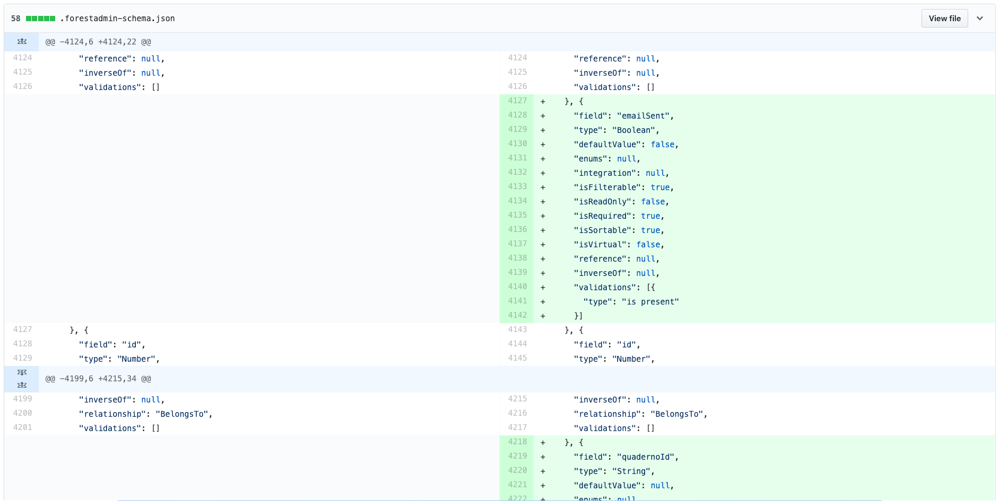

# Upgrade to v3



Please be aware that while Forest Admin make every effort to ensure that our platform updates are broadly compatible and offer detailed instructions for upgrading, Forest Admin cannot guarantee that custom code developed by the developers will always be compatible with new versions of our software. This includes any custom modifications or extensions to core functionalities, such as method overrides or custom integrations. It is the responsibility of the developers to review and test their custom code to ensure compatibility with each new version. Our team provides comprehensive upgrade guides to assist in this process, but these cannot encompass the unique customizations that may be present in each customer's environment. Therefore, Forest Admin strongly recommend establishing a thorough testing protocol for your specific customizations to safeguard against potential issues during the upgrade process.



## Breaking changes

### Cors configuration

Set CORS `credentials: true` if you're using custom CORS configuration. See [how to configure CORS headers](../../setup/configuring-cors-headers.md).



We use the [Rack CORS](https://github.com/cyu/rack-cors) Gem for this purpose.


```ruby
# Gemfile
source 'https://rubygems.org'

# ...

gem 'forest_liana'
gem 'rack-cors'
```



```ruby
module LiveDemoRails
  class Application < Rails::Application
    # ...

    # For Rails 5, use the class Rack::Cors. For Rails 4, you MUST use the string 'Rack::Cors'.
    config.middleware.insert_before 0, Rack::Cors do
      allow do
        origins 'app.forestadmin.com'
        resource '*',
          headers: :any,
          methods: :any,
          expose: ['Content-Disposition'],
          credentials: true
      end
    end
  end
end
```




### Global smart action

Smart actions defined as follows `global: true` will no longer be considered as global.&#x20;

Please now use `type: 'global'`.



**Before**


```ruby
class Forest::Product
  include ForestLiana::Collection

  collection :Product

  action 'Import data',
    global: true

  # ...
end
```


**After**


```ruby
class Forest::Product
  include ForestLiana::Collection

  collection :Product

  action 'Import data',
    type: 'global'

  # ...
end
```




### Schema versioning

On server start - _only in development environments_ - the agent will generate a `.forestadmin-schema.json` file reflecting your **Forest Admin schema**.

If you change your models or database, Forest Admin will automatically load a new schema to keep the layout up to date.


**Do not edit this file**. It will be automatically generated on server start **only in development environments**.

This file **must be deployed** for any remote environment (staging, production, etc.), as it will be used to generate your Forest Admin UI.



**Version this file.** It will give you more visibility on the changes detected by Forest Admin.


In the following example, we have added two fields on the `invoices` table:

* `emailSent`
* `quadernoId`

Versioning the`.forestadmin-schema.json` file allows you to easily visualize the changes.



## Changelogs

This release note covers only the major changes. To learn more, please refer to the changelogs in our different repositories:

* [Rails changelog](https://github.com/ForestAdmin/forest-rails/blob/master/CHANGELOG.md#release-300---2019-04-22)
