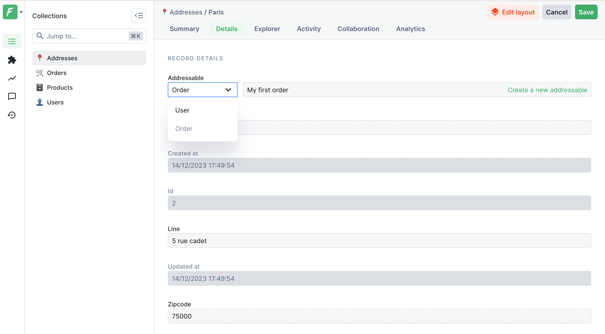
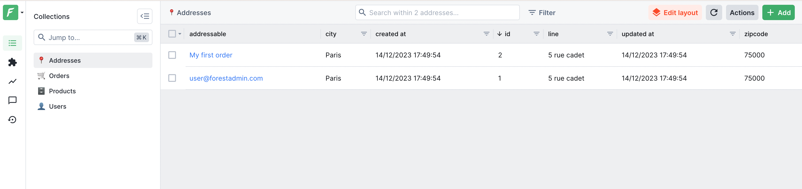


Please be sure of your agent type and version and pick the right documentation accordingly.





This is the documentation of the `forest-express-sequelize` and `forest-express-mongoose` Node.js agents that will soon reach end-of-support.

`forest-express-sequelize` v9 and `forest-express-mongoose` v9 are replaced by [`@forestadmin/agent`](https://docs.forestadmin.com/developer-guide-agents-nodejs/) v1.

Please check your agent type and version and read on or switch to the right documentation.





This is still the latest Ruby on Rails documentation of the `forest_liana` agent, you’re at the right place, please read on.





This is the documentation of the `django-forestadmin` Django agent that will soon reach end-of-support.

If you’re using a Django agent, notice that `django-forestadmin` v1 is replaced by [`forestadmin-agent-django`](https://docs.forestadmin.com/developer-guide-agents-python) v1.

If you’re using a Flask agent, go to the [`forestadmin-agent-flask`](https://docs.forestadmin.com/developer-guide-agents-python) v1 documentation.

Please check your agent type and version and read on or switch to the right documentation.





This is the documentation of the `forestadmin/laravel-forestadmin` Laravel agent that will soon reach end-of-support.

If you’re using a Laravel agent, notice that `forestadmin/laravel-forestadmin` v1 is replaced by [`forestadmin/laravel-forestadmin`](https://docs.forestadmin.com/developer-guide-agents-php) v3.

If you’re using a Symfony agent, go to the [`forestadmin/symfony-forestadmin`](https://docs.forestadmin.com/developer-guide-agents-php) v1 documentation.

Please check your agent type and version and read on or switch to the right documentation.




# Upgrade to v9



Please be aware that while Forest Admin make every effort to ensure that our platform updates are broadly compatible and offer detailed instructions for upgrading, Forest Admin cannot guarantee that custom code developed by the developers will always be compatible with new versions of our software. This includes any custom modifications or extensions to core functionalities, such as method overrides or custom integrations. It is the responsibility of the developers to review and test their custom code to ensure compatibility with each new version. Our team provides comprehensive upgrade guides to assist in this process, but these cannot encompass the unique customizations that may be present in each customer's environment. Therefore, Forest Admin strongly recommend establishing a thorough testing protocol for your specific customizations to safeguard against potential issues during the upgrade process.



This upgrade unlocks the following feature:

- Support polymorphic associations

## Upgrading to v9


As for any dependency upgrade, it's very important to **test this upgrade** **in your testing environments**. Not doing so could result in your admin panel being unusable.


To upgrade to v9, first update your project according to the [_Breaking Changes_](../upgrade-notes-rails/upgrade-to-v9.md#breaking-changes) section below.&#x20;

If you're upgrading from an older version, please make sure you've also read the previous upgrade notes ([v8](upgrade-to-v8.md), [v7](upgrade-to-v7.md), [v6](upgrade-to-v6.md),..)

To upgrade to v9, **update the version in your Gemfile**, then run the following and update your project as shown in the _Breaking Changes_ section below.

```bash
bundle install
```


In case of a regression introduced in Production after the upgrade, a rollback to your previous agent version 8 is the fastest way to restore your admin panel.


## Breaking changes

This new version introduces support for polymorphic associations.

It's now easier to create or update polymorphic associations using the polymorphic record selection component.



You can now navigate between related records through the related link.




The `<record>_type` and `<record>_id` fields are no longer returned by the API. As a result, if you have set up a segment, scope, smart action or any others features that uses these fields, they will no longer work.

