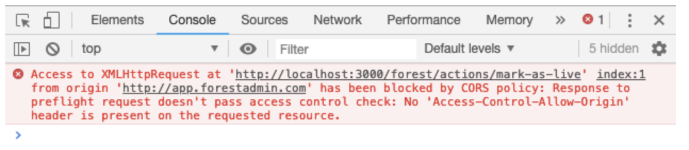


Please be sure of your agent type and version and pick the right documentation accordingly.





This is the documentation of the `forest-express-sequelize` and `forest-express-mongoose` Node.js agents that will soon reach end-of-support.

`forest-express-sequelize` v9 and `forest-express-mongoose` v9 are replaced by [`@forestadmin/agent`](https://docs.forestadmin.com/developer-guide-agents-nodejs/) v1.

Please check your agent type and version and read on or switch to the right documentation.





This is still the latest Ruby on Rails documentation of the `forest_liana` agent, you’re at the right place, please read on.





This is the documentation of the `django-forestadmin` Django agent that will soon reach end-of-support.

If you’re using a Django agent, notice that `django-forestadmin` v1 is replaced by [`forestadmin-agent-django`](https://docs.forestadmin.com/developer-guide-agents-python) v1.

If you’re using a Flask agent, go to the [`forestadmin-agent-flask`](https://docs.forestadmin.com/developer-guide-agents-python) v1 documentation.

Please check your agent type and version and read on or switch to the right documentation.





This is the documentation of the `forestadmin/laravel-forestadmin` Laravel agent that will soon reach end-of-support.

If you’re using a Laravel agent, notice that `forestadmin/laravel-forestadmin` v1 is replaced by [`forestadmin/laravel-forestadmin`](https://docs.forestadmin.com/developer-guide-agents-php) v3.

If you’re using a Symfony agent, go to the [`forestadmin/symfony-forestadmin`](https://docs.forestadmin.com/developer-guide-agents-php) v1 documentation.

Please check your agent type and version and read on or switch to the right documentation.




# Configuring CORS headers

Depending on how you've setup your app, you may encounter a [CORS](https://en.wikipedia.org/wiki/Cross-origin_resource_sharing) error. It will look like this in your browser console:



In this case, you need to configure the right CORS headers to **allow the domain** `app.forestadmin.com` to trigger an API call on your Application URL, which is a different domain name (e.g. localhost:3000 on development).



We use the [Rack CORS](https://github.com/cyu/rack-cors) Gem for this purpose.



```ruby
# Gemfile
source 'https://rubygems.org'

# ...

gem 'forest_liana'
gem 'rack-cors'
```





```ruby
module YourApp
  class Application < Rails::Application
    # ...

    # For Rails 5, use the class Rack::Cors. For Rails 4, you MUST use the string 'Rack::Cors'.
    null_regex = Regexp.new(/\Anull\z/)
    config.middleware.insert_before 0, Rack::Cors do
      allow do
        hostnames = [null_regex, 'localhost:4200', 'app.forestadmin.com', 'localhost:3001']
        hostnames += ENV['CORS_ORIGINS'].split(',') if ENV['CORS_ORIGINS']
        origins hostnames
        resource '*',
          headers: :any,
          methods: :any,
          expose: ['Content-Disposition'],
          credentials: true
      end
    end
  end
end
```




