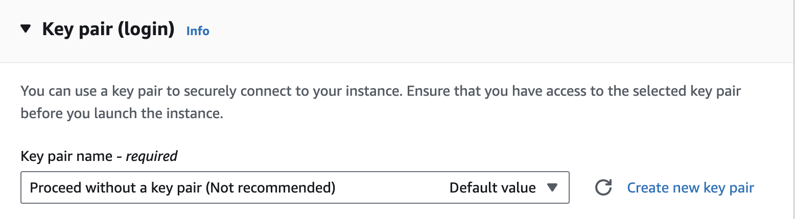
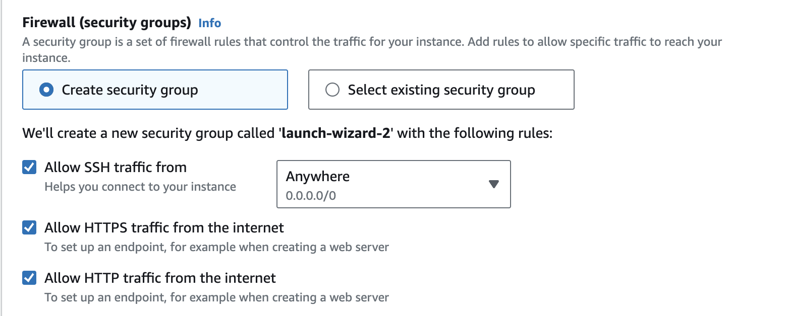
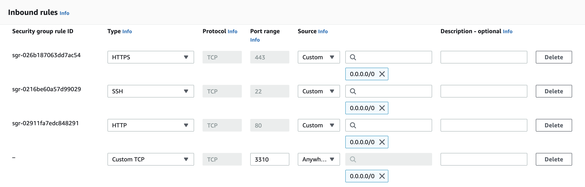
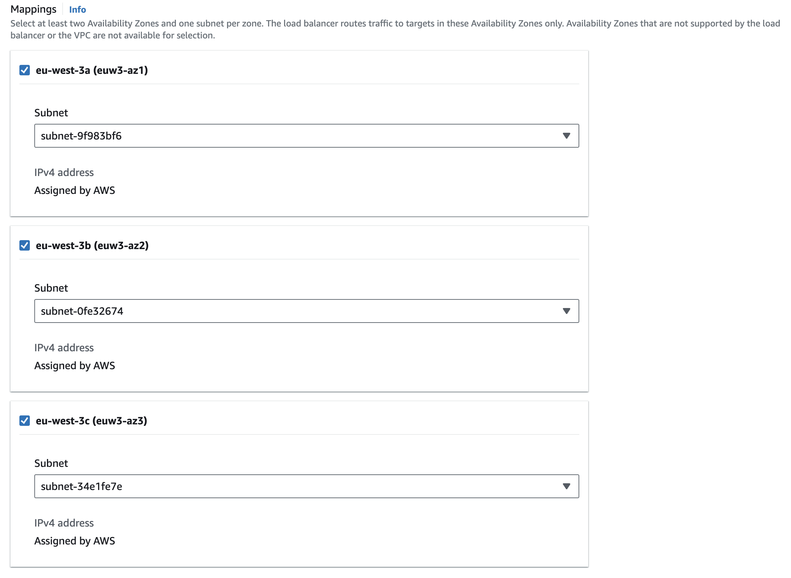
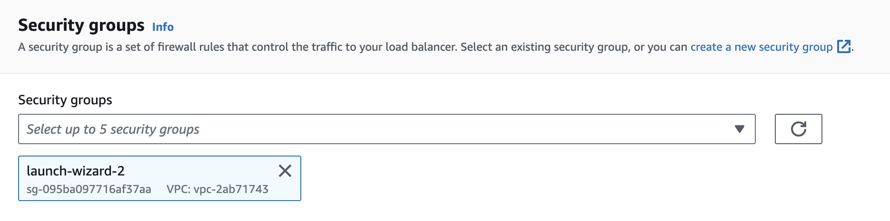
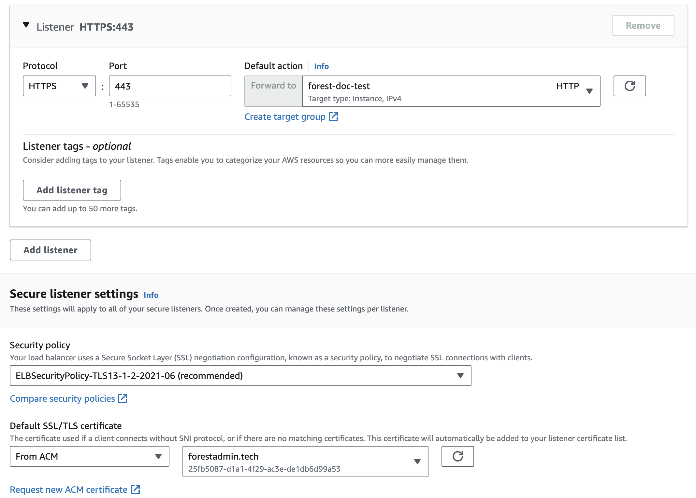


Please be sure of your agent type and version and pick the right documentation accordingly.





This is the documentation of the `forest-express-sequelize` and `forest-express-mongoose` Node.js agents that will soon reach end-of-support.

`forest-express-sequelize` v9 and `forest-express-mongoose` v9 are replaced by [`@forestadmin/agent`](https://docs.forestadmin.com/developer-guide-agents-nodejs/) v1.

Please check your agent type and version and read on or switch to the right documentation.





This is still the latest Ruby on Rails documentation of the `forest_liana` agent, you’re at the right place, please read on.





This is the documentation of the `django-forestadmin` Django agent that will soon reach end-of-support.

If you’re using a Django agent, notice that `django-forestadmin` v1 is replaced by [`forestadmin-agent-django`](https://docs.forestadmin.com/developer-guide-agents-python) v1.

If you’re using a Flask agent, go to the [`forestadmin-agent-flask`](https://docs.forestadmin.com/developer-guide-agents-python) v1 documentation.

Please check your agent type and version and read on or switch to the right documentation.





This is the documentation of the `forestadmin/laravel-forestadmin` Laravel agent that will soon reach end-of-support.

If you’re using a Laravel agent, notice that `forestadmin/laravel-forestadmin` v1 is replaced by [`forestadmin/laravel-forestadmin`](https://docs.forestadmin.com/developer-guide-agents-php) v3.

If you’re using a Symfony agent, go to the [`forestadmin/symfony-forestadmin`](https://docs.forestadmin.com/developer-guide-agents-php) v1 documentation.

Please check your agent type and version and read on or switch to the right documentation.




First, please ensure you have an AWS account. You can sign up [here](https://aws.amazon.com/).

### 1. Launch an EC2 Instance:

- Navigate to the EC2 dashboard and click on `Launch Instance`.
- Choose an Amazon Machine Image (AMI) such as `Amazon Linux 2023 AMI`.
- Select `t2.micro` (part of the AWS Free Tier).
- Select `Proceed without a key pair`



- On the `Configure Security Group` step, create a new security group:
  - allow `ssh traffic`.
  - allow `HTTPS traffic`.
  - allow `HTTP traffic`.



- Review and launch the instance.

### 2. Connect to the EC2 instance:

- Navigate to your EC2 instance and click on `Connect`.
- Leave the default parameters and click on `Connect` again.
- Your are now connected to your instance.

### 3. Set up your instance:


The command lines in this step demonstrate how to install a Node.js agent. If you are running Forest Admin on another agent, please adapt the following to your specific stack.


- Update the instance:

```bash
sudo yum update -y
```

- Install Git:

```bash
sudo yum install git -y
```

- Clone your repo:

```bash
git clone your-repo-link
```

- Install Node.js and npm:

```bash
sudo yum install npm -y
```

- Navigate to your project directory and install the necessary packages:

```bash
cd your-repo-directory
npm install
```

- Set up all the necessary environment variables provided by the Forest Admin environment creation wizard.

- Add the `APPLICATION_PORT` environment variable to be able to contact the server from outside. In this example, we will choose `APPLICATION_PORT=3310`. If you choose another port, please adapt the next steps accordingly.

- Start the agent

```bash
npm run start:watch
```

### 4. Adjust security group rules:

- Navigate to your EC2 instance's security group.
- Click on `Edit inbound rules`.
- Add a Custom TCP inbound rule to allow on port `3310`.



### 5. Create a target group:

- In the AWS Management Console, navigate to the EC2 service.
- Under "Target Groups", click `Create Target Groups`.
- Ensure target type is instance.
- Choose HTTP to `3310`.
- Ensure VPC is set to the same VPC as your EC2 instance.
- Setup the health checks as set to `/forest`.
- On the next step, select instance and click on `Include as pending below`.
- Finally create the target group.

### 6. Request a certificate using AWS Certificate Manager (ACM):

- Navigate to ACM and click on `Request a certificate`.
- Enter your domain name and validate the domain ownership using DNS validation.
- After viewing the new created certificate, click on `Create records in Route 53`.
- Wait for the certificate to be validated (this can take some time < 1mn).

### 7. Set up an Application Load Balancer (ALB):

- In the AWS Management Console, navigate to the EC2 service.
- Under "Load Balancers", click `Create Load Balancer`.
- Choose `Application Load Balancer` and follow the setup.
- Ensure the ALB is set to the same VPC as your EC2 instance.
- Select all regions.



- Remove default security group and select the group associated to the newly created instance.



- Add an HTTPS listener and choose previously created target group and certificate.



- After creating the ALB copy the `DNS name`.

### 8. Add CNAME to Route53:

- Navigate to Route53 and choose your hosted zone (domain).
- Create a `CNAME` record with the domain name filled in the certificate and the `DNS name` of the ALB.

### 9. Finalize:

Check your domain. You should be able to access your Forest Admin panel environment hosted on AWS. 🎉


This is a basic setup, and there are many optimizations and security enhancements (like using RDS, tightening security groups, etc.) that can be done for a production-ready deployment. Please refer to the [AWS documentation](https://docs.aws.amazon.com/index.html) to go deeper.

