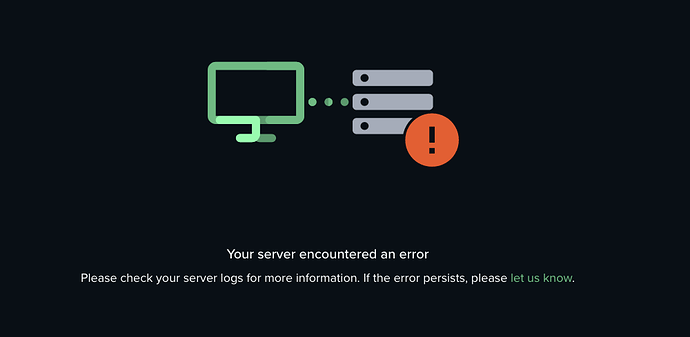


Please be sure of your agent type and version and pick the right documentation accordingly.





This is the documentation of the `forest-express-sequelize` and `forest-express-mongoose` Node.js agents that will soon reach end-of-support.

`forest-express-sequelize` v9 and `forest-express-mongoose` v9 are replaced by [`@forestadmin/agent`](https://docs.forestadmin.com/developer-guide-agents-nodejs/) v1.

Please check your agent type and version and read on or switch to the right documentation.





This is still the latest Ruby on Rails documentation of the `forest_liana` agent, you’re at the right place, please read on.





This is the documentation of the `django-forestadmin` Django agent that will soon reach end-of-support.

If you’re using a Django agent, notice that `django-forestadmin` v1 is replaced by [`forestadmin-agent-django`](https://docs.forestadmin.com/developer-guide-agents-python) v1.

If you’re using a Flask agent, go to the [`forestadmin-agent-flask`](https://docs.forestadmin.com/developer-guide-agents-python) v1 documentation.

Please check your agent type and version and read on or switch to the right documentation.





This is the documentation of the `forestadmin/laravel-forestadmin` Laravel agent that will soon reach end-of-support.

If you’re using a Laravel agent, notice that `forestadmin/laravel-forestadmin` v1 is replaced by [`forestadmin/laravel-forestadmin`](https://docs.forestadmin.com/developer-guide-agents-php) v3.

If you’re using a Symfony agent, go to the [`forestadmin/symfony-forestadmin`](https://docs.forestadmin.com/developer-guide-agents-php) v1 documentation.

Please check your agent type and version and read on or switch to the right documentation.




# Troubleshooting

#### ❓ Don't you see an answer to your problem? Describe it on our [Developer Community Forum](https://community.forestadmin.com/) and we will answer quickly.

## Error messages

### Installation

#### Docker

🙋‍♂️I can’t connect to Postgres DB inside another docker container. I'm trying to install Forest Admin using docker but my database is running inside a different container and I'm using a custom port. I can access it without any problems via `psql` but then I get an error.

✅ Such an issue has been solved on our community forum. [Check it out.](https://community.forestadmin.com/t/cant-connect-to-postgres-db-inside-another-docker-container/725)

🙋🏾‍♂️ After installing Forest Admin with Docker, I expect to see my visual data. Instead, I'm getting such error:

✅ Such an issue has been solved on our community forum. [Check it out](https://community.forestadmin.com/t/your-server-encountered-an-error-getaddrinfo-enotfound-postgres-postgres-5432/1798).

🙋🏻 When I want to pull data from my MongoDB database when installing Forest Admin with Docker, I keep getting an error even when I changed to all access.

✅ Such an issue has been solved on our community forum. [Check it out](https://community.forestadmin.com/t/getting-error-mongoserverselectionerror-connection-monitor-to-54-71-237-255-27017-closed/3146).

🙋‍♂️ When I try to deploy lumber-admin via Docker with a remote database, I am getting an error `Error: Unprocessable Entity`

I suspect a problem on DB, but I cannot find any details or logs about this event. So, my main question is: where I can find any logs?

✅ Such an issue has been solved on our community forum. [Check it out](https://community.forestadmin.com/t/getting-error-mongoserverselectionerror-connection-monitor-to-54-71-237-255-27017-closed/3146).

<!-- markdown-link-check-disable -->

🙋🏾 I was able to link my data to Forest admin (with docker, on port 5433). When I run [http://localhost:3310](http://localhost:3310) it says my app is running but when I want to log to Forest Admin on [http://app.forestadmin.com/](http://app.forestadmin.com/) I first have to log in and it then says _Your server encountered an error_.

<!-- markdown-link-check-enable -->

✅ Such an issue has been solved on our community forum. [Check it out](https://community.forestadmin.com/t/new-postgres-db-cant-reach-forest-admin-panel/1378).

#### npm

🙋🏼‍♀️ When installing via npm, everything worked well up to the “npm start” command when I received an error.

✅ A similar issue has been solved on our community forum. [Check it out.](https://community.forestadmin.com/t/npm-start-error/1520)

#### Nodejs app with Express and Sequelize

🙋🏼 Once I create an account, a project, and then try to install Forest Admin with either an npm or a Docker, the setup fails with the error `SequelizeAssociationError`

✅ A similar issue has been solved on our community forum. [Check it out](https://community.forestadmin.com/t/setup-fails-with-sequelizeassociationerror/519).

#### Ruby on Rails

🙋🏻‍♀️ I created a new project using Ruby on Rails as the datasource. I followed instructions, added gem, migrated, `dev:cache`, and started the server. Everything went smoothly, but once on the admin panel, I am getting the following message:

_Unable to authenticate you_

_Please verify that your admin backend is correctly configured and running._

✅ Such an issue has been solved on our community forum. [Check it out](https://community.forestadmin.com/t/unable-to-authenticate-you-please-verify-that-your-admin-backend-is-correctly-configured-and-running/2017).

### Deployment

🙋🏽‍♀️ When I try to deploy Forest Admin to Heroku, it tells me the app crashed after running either `npm start` or `docker compose` up in the project directory.

✅ Such an issue has been solved on our community forum. [Check it out](https://community.forestadmin.com/t/h10-error-when-deploying-to-heroku/547).
