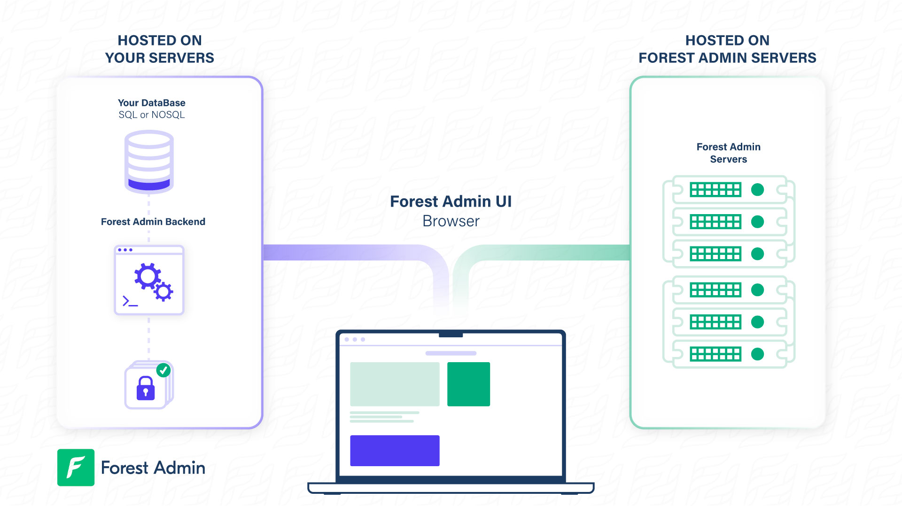


Please be sure of your agent type and version and pick the right documentation accordingly.





This is the documentation of the `forest-express-sequelize` and `forest-express-mongoose` Node.js agents that will soon reach end-of-support.

`forest-express-sequelize` v9 and `forest-express-mongoose` v9 are replaced by [`@forestadmin/agent`](https://docs.forestadmin.com/developer-guide-agents-nodejs/) v1.

Please check your agent type and version and read on or switch to the right documentation.





This is still the latest Ruby on Rails documentation of the `forest_liana` agent, you’re at the right place, please read on.





This is the documentation of the `django-forestadmin` Django agent that will soon reach end-of-support.

If you’re using a Django agent, notice that `django-forestadmin` v1 is replaced by [`forestadmin-agent-django`](https://docs.forestadmin.com/developer-guide-agents-python) v1.

If you’re using a Flask agent, go to the [`forestadmin-agent-flask`](https://docs.forestadmin.com/developer-guide-agents-python) v1 documentation.

Please check your agent type and version and read on or switch to the right documentation.





This is the documentation of the `forestadmin/laravel-forestadmin` Laravel agent that will soon reach end-of-support.

If you’re using a Laravel agent, notice that `forestadmin/laravel-forestadmin` v1 is replaced by [`forestadmin/laravel-forestadmin`](https://docs.forestadmin.com/developer-guide-agents-php) v3.

If you’re using a Symfony agent, go to the [`forestadmin/symfony-forestadmin`](https://docs.forestadmin.com/developer-guide-agents-php) v1 documentation.

Please check your agent type and version and read on or switch to the right documentation.




# Why HTTPS is necessary even locally

### Overview

When embedding Forest Admin in your app, you'll be asked for the local application URL during the installation process. This URL must be in HTTPS, except for `localhost`.

This article explains why HTTPS is necessary and provides step-by-step guidance on how to set up a secure connection.

### Importance of HTTPS for Forest Admin

Forest Admin's architecture relies on secure communication between the front-end and the agent. Modern browsers enforce strict security measures to ensure data privacy and integrity. As a result, HTTPS is required when connecting to the agent.

As shown in the architecture schema, the front-end of Forest Admin is in HTTPS. To make calls to the agent, modern browsers require the agent endpoint to be in HTTPS as well.

This ensures that data transmitted between the front-end and the agent is encrypted and secure.

### Setting Up a HTTPS Address: Step-by-Step Guide

If your app URL is in HTTP, you can use a tunneling software to access it through HTTPS. This enables Forest Admin to establish a secure connection with your app. Follow these steps to set up a HTTPS address:

1. Choose a tunneling software: Some popular options include:

- [Ngrok](https://ngrok.com/)
- [Bastion](https://github.com/bastion-rs/bastion)
- [Localtunnel](https://localtunnel.github.io/www/)

1. Download and install the tunneling software according to its documentation.
2. Configure the tunneling software to point to your app's HTTP address. This usually involves specifying the local HTTP address and the desired HTTPS address or port number.
3. Start the tunneling software. This will create a secure connection between your app's HTTP address and the new HTTPS address.
4. Test the HTTPS address by accessing it through your browser or another tool. Ensure that the connection is secure and that your app functions correctly.
5. Provide the HTTPS address during the Forest Admin installation process. Forest Admin will now be able to securely connect with your app.

By following these steps and ensuring HTTPS is used for local connections, Forest Admin maintains high security standards and offers a robust admin panel solution that protects both user data and application integrity.
