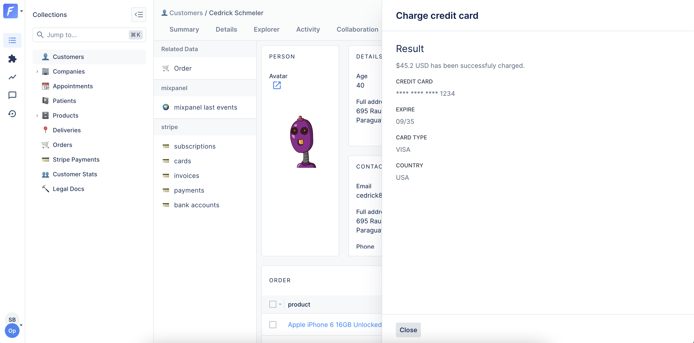

# Create and manage Smart Actions

### What is a Smart Action?

Sooner or later, you will need to perform actions on your data that are specific to your business. Moderating comments, generating an invoice, logging into a customer’s account or banning a user are exactly the kind of important tasks to unlock in order to manage your day-to-day operations.

On our Live Demo example, our `companies` collection has many examples of Smart Action. The simplest one is `Mark as live`.


If you're looking for information on native actions (CRUD), check out [this page](../).


### Creating a Smart action

In order to create a Smart action, you will first need to **declare it in your code** for a specific collection. Here we declare a _Mark as Live_ Smart action for the `companies` collection.




```javascript
const { collection } = require('forest-express-sequelize');

collection('companies', {
  actions: [{
    name: 'Mark as Live'
  }],
});
```





```javascript
const { collection } = require('forest-express-mongoose');

collection('companies', {
  actions: [{
    name: 'Mark as Live'
  }],
});
```





```ruby
class Forest::Company
  include ForestLiana::Collection

  collection :Company

  action 'Mark as Live'
end
```





```python
from django_forest.utils.collection import Collection
from app.models import Company

class CompanyForest(Collection):
    def load(self):
        self.actions = [{
            'name': 'Mark as Live'
        }]

Collection.register(CompanyForest, Company)
```


Ensure the file app/forest/\_\_init\_\_.py exists and contains the import of the previous defined class :


```python
from app.forest.companies import CompanyForest
```





```php
<?php

namespace App\Models;

use ForestAdmin\LaravelForestAdmin\Services\Concerns\ForestCollection;
use ForestAdmin\LaravelForestAdmin\Services\SmartFeatures\SmartAction;
use Illuminate\Database\Eloquent\Factories\HasFactory;
use Illuminate\Database\Eloquent\Model;

/**
 * Class Company
 */
class Company extends Model
{
    use HasFactory;
    use ForestCollection;

    /**
     * @return SmartAction
     */
    public function markAsLive(): SmartAction
    {
        return $this->smartAction('single', 'Mark as Live');
    }
}
```




After declaring it, your Smart action will appear in the Smart actions tab within your [collection settings](https://docs.forestadmin.com/user-guide/collections/manage-your-collection-settings).


A Smart action is displayed in the UI only if:

* it is set as "visible" (see screenshot below)\
  AND
* in non-development environments, the user's [role ](https://docs.forestadmin.com/user-guide/project-settings/teams-and-users/manage-roles)must grant the "trigger" permission


You must make the action visible there if you wish users to be able to see it.


It will then show in the actions dropdown button:



At this point, the Smart Action does _nothing_, because no route in your Admin backend handles the API call yet.


The **Smart Action behavior** is implemented separately from the declaration.

In the following example, we've implemented the _Mark as live_ Smart Action, which simply changes a company's status to `live`.




```javascript
const { PermissionMiddlewareCreator } = require('forest-express-sequelize');
const permissionMiddlewareCreator = new PermissionMiddlewareCreator('companies');

...

router.post('/actions/mark-as-live', permissionMiddlewareCreator.smartAction(), (req, res) => {
  const recordsGetter = new RecordsGetter(companies, request.user, request.query);

  return recordsGetter.getIdsFromRequest(req)
    .then(companyIds => companies.update({ status: 'live' }, { where: { id: companyIds }}))
    .then(() => res.send({ success: 'Company is now live!' }));
});

...

module.exports = router;
```



You must make sure that all your Smart Actions routes are configured with the Smart Action middleware:
`permissionMiddlewareCreator.smartAction()`. This is mandatory to ensure that all features built on top of Smart Actions work as expected (permissions, approval workflows,...).






```javascript
const { PermissionMiddlewareCreator } = require('forest-express-mongoose');
const permissionMiddlewareCreator = new PermissionMiddlewareCreator('companies');
...

router.post('/actions/mark-as-live', permissionMiddlewareCreator.smartAction(), (req, res) => {
  const recordsGetter = new RecordsGetter(companies, request.user, request.query);

  return recordsGetter.getIdsFromRequest(req)
    .then(companyIds => companies.updateMany({ _id: { $in: companyIds }}, { $set: { status: 'live' }}))
    .then(() => res.send({ success: 'Company is now live!' }));
});

...

module.exports = router;
```



You must make sure that all your Smart Actions routes are configured with the Smart Action middleware:
`permissionMiddlewareCreator.smartAction()`. This is mandatory to ensure that all features built on top of Smart Actions work as expected (permissions, approval workflows,...).





The route declaration takes place in `config/routes.rb`.


```javascript
Rails.application.routes.draw do
  # MUST be declared before the mount ForestLiana::Engine.
  namespace :forest do
    post '/actions/mark-as-live' => 'companies#mark_as_live'
  end

  mount ForestLiana::Engine => '/forest'
end
```


The business logic in this Smart Action is extremely simple. We only update here the attribute `status` of the companies to the value `live`:


```ruby
class Forest::CompaniesController < ForestLiana::SmartActionsController
  def mark_as_live
    company_id = ForestLiana::ResourcesGetter.get_ids_from_request(params, forest_user).first
    Company.update(company_id, status: 'live')
​
    head :no_content
  end
end
```



You must make sure that all your Smart Actions controllers extend from the `ForestLiana::SmartActionsController`. This is mandatory to ensure that all features built on top of Smart Actions work as expected (authentication, permissions, approval workflows,...)



You may have to [add CORS headers](../../../how-tos/setup/configuring-cors-headers.md) to enable the domain `app.forestadmin.com` to trigger API call on your Application URL, which is on a different domain name (e.g. _localhost:3000_).




Make sure your **project** `urls.py` file include you app urls with the `forest` prefix.


```javascript
from django.contrib import admin
from django.urls import path, include

urlpatterns = [
    path('forest', include('app.urls')),
    path('forest', include('django_forest.urls')),
    path('admin/', admin.site.urls),
]
```


The route declaration takes place in `app/urls.py`.


```javascript
from django.urls import path
from django.views.decorators.csrf import csrf_exempt

from . import views

app_name = 'app'
urlpatterns = [
    path('/actions/mark-as-live', csrf_exempt(views.MarkAsLiveView.as_view()), name='mark-as-live'),
]
```


The business logic in this Smart Action is extremely simple. We only update here the attribute `status` of the companies to the value `live`:


```python
from django.http import JsonResponse
from django_forest.utils.views.action import ActionView


class MarkAsLiveView(ActionView):

    def post(self, request, *args, **kwargs):
        params = request.GET.dict()
        body = self.get_body(request.body)
        ids = self.get_ids_from_request(request, self.Model)

        return JsonResponse({'success': 'live!'})
```


Note that Forest Admin takes care of the authentication thanks to the `ActionView` parent class view.


You may have to [add CORS headers](../../../how-tos/setup/configuring-cors-headers.md) to enable the domain `app.forestadmin.com` to trigger API call on your Application URL, which is on a different domain name (e.g. _localhost:8000_).




The route declaration takes place in `routes/web.php`.


```php
<?php

use App\Http\Controllers\CompaniesController;
use App\Http\Controllers\OrdersController;
use Illuminate\Support\Facades\Route;

Route::post('forest/smart-actions/company_mark-as-live', [CompaniesController::class, 'markAsLive']);
```


The business logic in this Smart Action is extremely simple. We only update here the attribute `status` of the companies to the value `live`:


```php
<?php

namespace App\Http\Controllers;

use App\Models\Company;
use ForestAdmin\LaravelForestAdmin\Http\Controllers\ForestController;
use Illuminate\Http\JsonResponse;

/**
 * Class CompaniesController
 */
class CompaniesController extends ForestController
{
    /**
     * @return JsonResponse
     */
    public function markAsLive(): JsonResponse
    {
        $id = request()->input('data.attributes.ids')[0];
        $company = Company::findOrFail($id);
        $company->status = 'live';
        $company->save();

        return response()->noContent();
    }
}
```




#### What's happening under the hood?

When you trigger the Smart Action from the UI, your browser will make an API call: `POST /forest/actions/mark-as-live`.


If you want to customize the API call, check the list of [available options](https://docs.forestadmin.com/documentation/reference-guide/actions/create-and-manage-smart-actions#available-smart-action-options).


The payload of the HTTP request is based on a [JSON API](http://jsonapi.org) document.\
The `data.attributes.ids` key allows you to retrieve easily the selected records from the UI.\
The `data.attributes.values` key contains all the values of your input fields ([handling input values](use-a-smart-action-form.md#handling-input-values)).\
Other properties of `data.attributes` are used to manage the _select all_ behavior.


```javascript
{
  "data": {
    "attributes": {
      "ids": ["1985"],
      "values": {},
      "collection_name": "companies",
      ...
    },
    "type": "custom-action-requests"
  }
}
```



Should you want not to use the `RecordsGetter` and use request attributes directly instead, be very careful about edge cases (related data view, etc).


### Available Smart Action options

Here is the list of available options to customize your Smart Action:

| Name       | Type             | Description                                                                                                                          |
| ---------- | ---------------- | ------------------------------------------------------------------------------------------------------------------------------------ |
| name       | string           | Label of the action displayed in Forest Admin.                                                                                       |
| type       | string           | (optional) [Type](../#triggering-different-types-of-actions) of the action. Can be `bulk`, `global` or `single`. Default is `bulk`.  |
| fields     | array of objects | (optional) Check the [handling input values](use-a-smart-action-form.md#handling-input-values) section.                              |
| download   | boolean          | (optional) If `true`, the action triggers a file download in the Browser. Default is `false`                                         |
| endpoint   | string           | (optional) Set the API route to call when clicking on the Smart Action. Default is `'/forest/actions/name-of-the-action-dasherized'` |
| httpMethod | string           | (optional) Set the HTTP method to use when clicking on the Smart Action. Default is `POST`.                                          |


Want to go further with Smart Actions? Read the [next page](use-a-smart-action-form.md) to discover how to make your Smart Actions even more powerful with **Forms**!


### Available Smart Action properties

#### req.user

The JWT Data Token contains all the details of the requesting user. On any authenticated request to your Admin Backend, you can access them with the variable `req.user`.

```javascript
req.user content example

{
  "id": "172",
  "email": "angelicabengtsson@doha2019.com",
  "firstName": "Angelica",
  "lastName": "Bengtsson",
  "team": "Pole Vault",
  "role": "Manager",
  "tags": [{ key: "country", value: "Canada" }],
  "renderingId": "4998",
  "iat": 1569913709,
  "exp": 1571123309
}
```

#### req.body

You can find important information in the body of the request.


This is particularly useful to find the context in which an action was performed via a relationship.


```javascript
{
  data: {
    attributes: {
      collection_name: 'users', //collection on which the action has been triggered
      values: {},
      ids: [Array], //IDs of selected records
      parent_collection_name: 'companies', //Parent collection name
      parent_collection_id: '1', //Parent collection id
      parent_association_name: 'users', //Name of the association
      all_records: false,
      all_records_subset_query: {},
      all_records_ids_excluded: [],
      smart_action_id: 'users-reset-password'
    },
    type: 'custom-action-requests'
  }
}
```

### Customizing response

#### Default success notification

Returning a 204 status code to the HTTP request of the Smart Action shows the default notification message in the browser.

On our Live Demo example, if our Smart Action `Mark as Live` route is implemented like this:


```javascript
...

router.post('/actions/mark-as-live', permissionMiddlewareCreator.smartAction(), (req, res) => {
  // ...
  res.status(204).send();
});

...
```


We will see a success message in the browser:


#### Custom success notification

If we return a 200 status code with an object `{ success: '...' }` as the payload like this…




```javascript
...

router.post('/actions/mark-as-live', permissionMiddlewareCreator.smartAction(), (req, res) => {
  // ...
  res.send({ success: 'Company is now live!' });
});

...
```





```javascript
...

router.post('/actions/mark-as-live', permissionMiddlewareCreator.smartAction(), (req, res) => {
  // ...
  res.send({ success: 'Company is now live!' });
});

...
```




```ruby
class Forest::CompaniesController < ForestLiana::SmartActionsController
  def mark_as_live
    # ...
    render json: { success: 'Company is now live!' }
  end
end
```




```python
from django.http import JsonResponse
from django_forest.utils.views.action import ActionView


class MarkAsLiveView(ActionView):

    def post(self, request, *args, **kwargs):
        return JsonResponse({'success': 'Company is now live!'})
```





```php
class CompaniesController extends ForestController
{
    /**
     * @return JsonResponse
     */
    public function markAsLive(): JsonResponse
    {
        # ....
        return response()->json(['success' => "Company is now live !"]);
    }
}
```




… the success notification will look like this:


#### Custom error notification

Finally, returning a 400 status code allows you to return errors properly.




```javascript
...

router.post('/actions/mark-as-live', permissionMiddlewareCreator.smartAction(), (req, res) => {
  // ...
  res.status(400).send({ error: 'The company was already live!' });
});

...
```





```javascript
...

router.post('/actions/mark-as-live', permissionMiddlewareCreator.smartAction(), (req, res) => {
  // ...
  res.status(400).send({ error: 'The company was already live!' });
});

...
```





```ruby
class Forest::CompaniesController < ForestLiana::SmartActionsController
  def mark_as_live
    # ...
    render status: 400, json: { error: 'The company was already live!' }
  end
end
```





```python
from django.http import JsonResponse
from django_forest.utils.views.action import ActionView


class MarkAsLiveView(ActionView):

    def post(self, request, *args, **kwargs):
        return JsonResponse({'error': 'The company was already live!'}, status=400)

```





```php
class CompaniesController extends ForestController
{
    /**
     * @return JsonResponse
     */
    public function markAsLive(): JsonResponse
    {
        # ....
        return response()->json(['error' => "The company was already live!"], 400);

    }
}
```





#### Custom HTML response

You can also return a HTML page as a response to give more feedback to the admin user who has triggered your Smart Action. To do this, you just need to return a 200 status code with an object `{ html: '...' }`.

On our Live Demo example, we’ve created a `Charge credit card` Smart Action on the Collection `customers`that returns a custom HTML response.




```javascript
const { collection } = require('forest-express-sequelize');

collection('customers', {
  actions: [{
    name: 'Charge credit card',
    type: 'single',
    fields: [{
      field: 'amount',
      isRequired: true,
      description: 'The amount (USD) to charge the credit card. Example: 42.50',
      type: 'Number'
    }, {
      field: 'description',
      isRequired: true,
      description: 'Explain the reason why you want to charge manually the customer here',
      type: 'String'
    }]
  }]
});
```



```javascript
...
const stripe = require('stripe')(process.env.STRIPE_SECRET_KEY);

router.post('/actions/charge-credit-card', permissionMiddlewareCreator.smartAction(), (req, res) => {
  let customerId = req.body.data.attributes.ids[0];
  let amount = req.body.data.attributes.values.amount * 100;
  let description = req.body.data.attributes.values.description;

  return customers
    .findByPk(customerId)
    .then((customer) => {
      return stripe.charges.create({
        amount: amount,
        currency: 'usd',
        customer: customer.stripe_id,
        description: description
      });
    })
    .then((response) => {
      res.send({
        html: `
        <p class="c-clr-1-4 l-mt l-mb">\$${response.amount / 100} USD has been successfully charged.</p>
        <strong class="c-form__label--read c-clr-1-2">Credit card</strong>
        <p class="c-clr-1-4 l-mb">**** **** **** ${response.source.last4}</p>
        <strong class="c-form__label--read c-clr-1-2">Expire</strong>
        <p class="c-clr-1-4 l-mb">${response.source.exp_month}/${response.source.exp_year}</p>
        <strong class="c-form__label--read c-clr-1-2">Card type</strong>
        <p class="c-clr-1-4 l-mb">${response.source.brand}</p>
        <strong class="c-form__label--read c-clr-1-2">Country</strong>
        <p class="c-clr-1-4 l-mb">${response.source.country}</p>
        `
      });
    });
});

...

module.exports = router;
```





```javascript
const { collection } = require('forest-express-mongoose');

collection('Customer', {
  actions: [{
    name: 'Charge credit card',
    type: 'single',
    fields: [{
      field: 'amount',
      isRequired: true,
      description: 'The amount (USD) to charge the credit card. Example: 42.50',
      type: 'Number'
    }, {
      field: 'description',
      isRequired: true,
      description: 'Explain the reason why you want to charge manually the customer here',
      type: 'String'
    }]
  }]
});
```



```javascript
...
const stripe = require('stripe')(process.env.STRIPE_SECRET_KEY);

router.post('/actions/charge-credit-card', (req, res) => {
  let customerId = req.body.data.attributes.ids[0];
  let amount = req.body.data.attributes.values.amount * 100;
  let description = req.body.data.attributes.values.description;

  return Customer
    .findById(customerId)
    .then((customer) => {
      return stripe.charges.create({
        amount: amount,
        currency: 'usd',
        customer: customer.stripe_id,
        description: description
      });
    })
    .then((response) => {
      res.send({
        html: `
        <p class="c-clr-1-4 l-mt l-mb">\$${response.amount / 100} USD has been successfully charged.</p>
        <strong class="c-form__label--read c-clr-1-2">Credit card</strong>
        <p class="c-clr-1-4 l-mb">**** **** **** ${response.source.last4}</p>
        <strong class="c-form__label--read c-clr-1-2">Expire</strong>
        <p class="c-clr-1-4 l-mb">${response.source.exp_month}/${response.source.exp_year}</p>
        <strong class="c-form__label--read c-clr-1-2">Card type</strong>
        <p class="c-clr-1-4 l-mb">${response.source.brand}</p>
        <strong class="c-form__label--read c-clr-1-2">Country</strong>
        <p class="c-clr-1-4 l-mb">${response.source.country}</p>
        `
      });
    });
});

...

module.exports = router;
```





```ruby
class Forest::Customer
  include ForestLiana::Collection

  collection :Customer

  action 'Charge credit card', type: 'single', fields: [{
    field: 'amount',
    is_required: true,
    description: 'The amount (USD) to charge the credit card. Example: 42.50',
    type: 'Number'
  }, {
    field: 'description',
    is_required: true,
    description: 'Explain the reason why you want to charge manually the customer here',
    type: 'String'
  }]
end
```



```ruby
Rails.application.routes.draw do
  # MUST be declared before the mount ForestLiana::Engine.
  namespace :forest do
    post '/actions/charge-credit-card' => 'customers#charge_credit_card'
  end

  mount ForestLiana::Engine => '/forest'
end
```



```ruby
class Forest::CustomersController < ForestLiana::SmartActionsController
  def charge_credit_card
    customer_id = ForestLiana::ResourcesGetter.get_ids_from_request(params).first
    amount = params.dig('data', 'attributes', 'values', 'amount').to_i
    description = params.dig('data', 'attributes', 'values', 'description')

    customer = Customer.find(customer_id)

    response = Stripe::Charge.create(
      amount: amount * 100,
      currency: 'usd',
      customer: customer.stripe_id,
      description: description
    )

    render json: { html: <<EOF
<p class="c-clr-1-4 l-mt l-mb">$#{response.amount / 100.0} USD has been successfully charged.</p>

<strong class="c-form__label--read c-clr-1-2">Credit card</strong>
<p class="c-clr-1-4 l-mb">**** **** **** #{response.source.last4}</p>

<strong class="c-form__label--read c-clr-1-2">Expire</strong>
<p class="c-clr-1-4 l-mb">#{response.source.exp_month}/#{response.source.exp_year}</p>

<strong class="c-form__label--read c-clr-1-2">Card type</strong>
<p class="c-clr-1-4 l-mb">#{response.source.brand}</p>

<strong class="c-form__label--read c-clr-1-2">Country</strong>
<p class="c-clr-1-4 l-mb">#{response.source.country}</p>
EOF
    }
  end
end
```




<pre class="language-python" data-title="app/forest/customer.py"><code class="lang-python"><strong>from django_forest.utils.collection import Collection
</strong>from app.models import Company

class CompanyForest(Collection):
    def load(self):
        self.actions = [{
            'name': 'Charge credit card',
            'fields': [
                {
                    'field': 'amount',
                    'description': 'The amount (USD) to charge the credit card. Example: 42.50',
                    'isRequired': True,
                    'type': 'Number'
                },
                {
                    'field': 'description',
                    'description': 'Explain the reason why you want to charge manually the customer here',
                    'isRequired': True,
                    'type': 'String'
                },
            ],
        }]

Collection.register(CompanyForest, Company)
</code></pre>


```python
from django.urls import path
from django.views.decorators.csrf import csrf_exempt

from . import views

app_name = 'app'
urlpatterns = [
    path('/actions/charge-credit-card', csrf_exempt(views.ChargeCreditCardView.as_view()), name='charge-credit-card'),
]
```



```python
import stripe

from django.http import JsonResponse
from django_forest.utils.views.action import ActionView

from .models import Customer

class ChargeCreditCardView(ActionView):

    def post(self, request, *args, **kwargs):
        params = request.GET.dict()
        body = self.get_body(request.body)
        ids = self.get_ids_from_request(request, self.Model)

        amount = body['data']['attributes']['values']['amount'] * 100
        description = body['data']['attributes']['values']['description']

        customer = Customer.object.get(pk=ids[0])

        stripe.api_key = os.getenv('STRIPE_SECRET_KEY')

        response = stripe.Charge.create(
          amount=amount,
          currency='usd',
          customer=customer.stripe_id,
          description=description,
        )

        data = f'''
        <p class="c-clr-1-4 l-mt l-mb">${response['amount'] / 100} USD has been successfully charged.</p>
        <strong class="c-form__label--read c-clr-1-2">Credit card</strong>
        <p class="c-clr-1-4 l-mb">**** **** **** {response['source']['last4']}</p>
        <strong class="c-form__label--read c-clr-1-2">Expire</strong>
        <p class="c-clr-1-4 l-mb">{response['source']['exp_month']}/{response['source']['exp_year']}</p>
        <strong class="c-form__label--read c-clr-1-2">Card type</strong>
        <p class="c-clr-1-4 l-mb">{response['source']['brand']}</p>
        <strong class="c-form__label--read c-clr-1-2">Country</strong>
        <p class="c-clr-1-4 l-mb">{response['source']['country']}</p>
        '''

        return JsonResponse({'html': data}, safe=False)
```





```php
<?php

namespace App\Models;

use ForestAdmin\LaravelForestAdmin\Services\Concerns\ForestCollection;
use ForestAdmin\LaravelForestAdmin\Services\SmartFeatures\SmartAction;
use Illuminate\Database\Eloquent\Factories\HasFactory;
use Illuminate\Database\Eloquent\Model;
use Illuminate\Database\Eloquent\Relations\HasMany;

/**
 * Class Customer
 */
class Customer extends Model
{
    use HasFactory, ForestCollection;

    /**
     * @return SmartAction
     */
    public function chargeCreditCard(): SmartAction
    {
        $this->smartAction('single', 'Charge credit card')
            ->addField(
                [
                    'field' => 'amount',
                    'type' => 'Number',
                    'is_required' => true,
                    'description' => 'The amount (USD) to charge the credit card. Example: 42.50'
                ]
            )
            ->addField(
                [
                    'field' => 'description',
                    'type' => 'String',
                    'is_required' => true,
                    'description' => 'Explain the reason why you want to charge manually the customer here'
                ]
            );

    }
```



```php
<?php

use App\Http\Controllers\CustomersController;
use Illuminate\Support\Facades\Route;

Route::post('forest/smart-actions/customer_charge-credit-card', [CustomersController::class, 'chargeCreditCard']);
```



```php
<?php

namespace App\Http\Controllers;

use App\Models\Customer;
use ForestAdmin\LaravelForestAdmin\Http\Controllers\ForestController;
use Illuminate\Http\JsonResponse;

/**
 * Class CustomersController
 */
class CustomersController extends ForestController
{
    /**
     * @return JsonResponse
     */
    public function chargeCreditCard(): JsonResponse
    {
        $customer = Customer::find(request()->input('data.attributes.ids')[0]);
        $stripe = new  (
            'sk_test_4eC39HqLyjWDarjtT1zdp7dc'
        );
        $response = $stripe->charges->create([
            'amount'      => request()->input('data.attributes.values.amount'),
            'currency'    => 'usd',
            'customer'    => $customer->stripe_id,
            'description' => 'My First Test Charge (created for API docs)',
        ]);


        return response()->json(
            ['html' => '
                <p class="c-clr-1-4 l-mt l-mb">'. $response->amount / 100 .' USD has been successfully charged.</p>

                <strong class="c-form__label--read c-clr-1-2">Credit card</strong>
                <p class="c-clr-1-4 l-mb">**** **** **** '. $response->source->last4 .'</p>

                <strong class="c-form__label--read c-clr-1-2">Expire</strong>
                <p class="c-clr-1-4 l-mb"> '. $response->source->exp_month .'/ '. $response->source->exp_year .'</p>

                <strong class="c-form__label--read c-clr-1-2">Card type</strong>
                <p class="c-clr-1-4 l-mb">'. $response->source->brand .'</p>

                <strong class="c-form__label--read c-clr-1-2">Country</strong>
                <p class="c-clr-1-4 l-mb">'. $response->source->country .'</p>
            ']
        );
    }
}
```




<figure><figcaption></figcaption></figure>

You can either respond with an HTML page in case of error. The user will be able to go back to his smart action's form by using the cross icon at the top right of the panel.




```javascript
const { collection } = require('forest-express-sequelize');

collection('customers', {
  actions: [{
    name: 'Charge credit card',
    type: 'single',
    fields: [{
      field: 'amount',
      isRequired: true,
      description: 'The amount (USD) to charge the credit card. Example: 42.50',
      type: 'Number'
    }, {
      field: 'description',
      isRequired: true,
      description: 'Explain the reason why you want to charge manually the customer here',
      type: 'String'
    }]
  }]
});
```



```javascript
...
const stripe = require('stripe')(process.env.STRIPE_SECRET_KEY);

router.post('/actions/charge-credit-card', permissionMiddlewareCreator.smartAction(), (req, res) => {
  let customerId = req.body.data.attributes.ids[0];
  let amount = req.body.data.attributes.values.amount * 100;
  let description = req.body.data.attributes.values.description;

  return customers
    .findByPk(customerId)
    .then((customer) => {
      return stripe.charges.create({
        amount: amount,
        currency: 'usd',
        customer: customer.stripe_id,
        description: description
      });
    })
    .then((response) => {
      res.status(400).send({
        html: `
        <p class="c-clr-1-4 l-mt l-mb">$${response.amount / 100} USD has not been charged.</p>
        <strong class="c-form__label--read c-clr-1-2">Credit card</strong>
        <p class="c-clr-1-4 l-mb">**** **** **** ${response.source.last4}</p>
        <strong class="c-form__label--read c-clr-1-2">Reason</strong>
        <p class="c-clr-1-4 l-mb">You can not charge this credit card. The card is marked as blocked</p>
        `
      });
    });
});

...

module.exports = router;
```





```javascript
const { collection } = require('forest-express-mongoose');

collection('Customer', {
  actions: [{
    name: 'Charge credit card',
    type: 'single',
    fields: [{
      field: 'amount',
      isRequired: true,
      description: 'The amount (USD) to charge the credit card. Example: 42.50',
      type: 'Number'
    }, {
      field: 'description',
      isRequired: true,
      description: 'Explain the reason why you want to charge manually the customer here',
      type: 'String'
    }]
  }]
});
```



```javascript
...
const stripe = require('stripe')(process.env.STRIPE_SECRET_KEY);

router.post('/actions/charge-credit-card', (req, res) => {
  let customerId = req.body.data.attributes.ids[0];
  let amount = req.body.data.attributes.values.amount * 100;
  let description = req.body.data.attributes.values.description;

  return Customer
    .findById(customerId)
    .then((customer) => {
      return stripe.charges.create({
        amount: amount,
        currency: 'usd',
        customer: customer.stripe_id,
        description: description
      });
    })
    .then((response) => {
      res.status(400).send({
        html: `
        <p class="c-clr-1-4 l-mt l-mb">\$${response.amount / 100} USD has not been charged.</p>
        <strong class="c-form__label--read c-clr-1-2">Credit card</strong>
        <p class="c-clr-1-4 l-mb">**** **** **** ${record.source.last4}</p>
        <strong class="c-form__label--read c-clr-1-2">Reason</strong>
        <p class="c-clr-1-4 l-mb">You can not charge this credit card. The card is marked as blocked</p>
        `
      });
    });
});

...

module.exports = router;
```





```ruby
class Forest::Customer
  include ForestLiana::Collection

  collection :Customer

  action 'Charge credit card', type: 'single', fields: [{
    field: 'amount',
    is_required: true,
    description: 'The amount (USD) to charge the credit card. Example: 42.50',
    type: 'Number'
  }, {
    field: 'description',
    is_required: true,
    description: 'Explain the reason why you want to charge manually the customer here',
    type: 'String'
  }]
end
```



```ruby
Rails.application.routes.draw do
  # MUST be declared before the mount ForestLiana::Engine.
  namespace :forest do
    post '/actions/charge-credit-card' => 'customers#charge_credit_card'
  end

  mount ForestLiana::Engine => '/forest'
end
```


<pre class="language-ruby" data-title="/app/controllers/forest/customers_controller.rb"><code class="lang-ruby">class Forest::CustomersController &#x3C; ForestLiana::SmartActionsController
  def charge_credit_card
    customer_id = ForestLiana::ResourcesGetter.get_ids_from_request(params, forest_user).first
    amount = params.dig('data', 'attributes', 'values', 'amount').to_i
    description = params.dig('data', 'attributes', 'values', 'description')

    customer = Customer.find(customer_id)

    response = Stripe::Charge.create(
      amount: amount * 100,
      currency: 'usd',
      customer: customer.stripe_id,
      description: description
    )

    render status: 400, json: {
      html: &#x3C;&#x3C;EOF
      &#x3C;p class="c-clr-1-4 l-mt l-mb">\$#{record.amount / 100} USD has not been charged.&#x3C;/p>
      &#x3C;strong class="c-form__label--read c-clr-1-2">Credit card&#x3C;/strong>
      &#x3C;p class="c-clr-1-4 l-mb">**** **** **** #{record.source.last4}&#x3C;/p>
      &#x3C;strong class="c-form__label--read c-clr-1-2">Reason&#x3C;/strong>
      &#x3C;p class="c-clr-1-4 l-mb">You can not charge this credit card. The card is marked as blocked&#x3C;/p>
<strong>      EOF
</strong>    }
  end
end
</code></pre>



<pre class="language-python" data-title="app/forest/customer.py"><code class="lang-python"><strong>from django_forest.utils.collection import Collection
</strong>from app.models import Company

class CompanyForest(Collection):
    def load(self):
        self.actions = [{
            'name': 'Charge credit card',
            'fields': [
                {
                    'field': 'amount',
                    'description': 'The amount (USD) to charge the credit card. Example: 42.50',
                    'isRequired': True,
                    'type': 'Number'
                },
                {
                    'field': 'description',
                    'description': 'Explain the reason why you want to charge manually the customer here',
                    'isRequired': True,
                    'type': 'String'
                },
            ],
        }]

Collection.register(CompanyForest, Company)
</code></pre>


```python
from django.urls import path
from django.views.decorators.csrf import csrf_exempt

from . import views

app_name = 'app'
urlpatterns = [
    path('/actions/charge-credit-card', csrf_exempt(views.ChargeCreditCardView.as_view()), name='charge-credit-card'),
]
```



```python
import stripe

from django.http import JsonResponse
from django_forest.utils.views.action import ActionView

from .models import Customer

class ChargeCreditCardView(ActionView):

    def post(self, request, *args, **kwargs):
        params = request.GET.dict()
        body = self.get_body(request.body)
        ids = self.get_ids_from_request(request, self.Model)

        amount = body['data']['attributes']['values']['amount'] * 100
        description = body['data']['attributes']['values']['description']

        customer = Customer.object.get(pk=ids[0])

        stripe.api_key = os.getenv('STRIPE_SECRET_KEY')

        response = stripe.Charge.create(
          amount=amount,
          currency='usd',
          customer=customer.stripe_id,
          description=description,
        )

        data = f'''
        <p class="c-clr-1-4 l-mt l-mb">\${response.amount / 100} USD has not been charged.</p>
        <strong class="c-form__label--read c-clr-1-2">Credit card</strong>
        <p class="c-clr-1-4 l-mb">**** **** **** {response['source']['last4']}</p>
        <strong class="c-form__label--read c-clr-1-2">Reason</strong>
        <p class="c-clr-1-4 l-mb">You can not charge this credit card. The card is marked as blocked</p>
        '''

        return JsonResponse({'html': data}, safe=False, status=status.HTTP_400_BAD_REQUEST)
```





```php
<?php

namespace App\Models;

use ForestAdmin\LaravelForestAdmin\Services\Concerns\ForestCollection;
use ForestAdmin\LaravelForestAdmin\Services\SmartFeatures\SmartAction;
use Illuminate\Database\Eloquent\Factories\HasFactory;
use Illuminate\Database\Eloquent\Model;
use Illuminate\Database\Eloquent\Relations\HasMany;

/**
 * Class Customer
 */
class Customer extends Model
{
    use HasFactory, ForestCollection;

    /**
     * @return SmartAction
     */
    public function chargeCreditCard(): SmartAction
    {
        $this->smartAction('single', 'Charge credit card')
            ->addField(
                [
                    'field' => 'amount',
                    'type' => 'Number',
                    'is_required' => true,
                    'description' => 'The amount (USD) to charge the credit card. Example: 42.50'
                ]
            )
            ->addField(
                [
                    'field' => 'description',
                    'type' => 'String',
                    'is_required' => true,
                    'description' => 'Explain the reason why you want to charge manually the customer here'
                ]
            );

    }
```



```php
<?php

use App\Http\Controllers\CustomersController;
use Illuminate\Support\Facades\Route;

Route::post('forest/smart-actions/customer_charge-credit-card', [CustomersController::class, 'chargeCreditCard']);
```



```php
<?php

namespace App\Http\Controllers;

use App\Models\Customer;
use ForestAdmin\LaravelForestAdmin\Http\Controllers\ForestController;
use Illuminate\Http\JsonResponse;

/**
 * Class CustomersController
 */
class CustomersController extends ForestController
{
    /**
     * @return JsonResponse
     */
    public function chargeCreditCard(): JsonResponse
    {
        $customer = Customer::find(request()->input('data.attributes.ids')[0]);
        $stripe = new  (
            'sk_test_4eC39HqLyjWDarjtT1zdp7dc'
        );
        $response = $stripe->charges->create([
            'amount'      => request()->input('data.attributes.values.amount'),
            'currency'    => 'usd',
            'customer'    => $customer->stripe_id,
            'description' => 'My First Test Charge (created for API docs)',
        ]);


        return response()->json(
            ['html' => '
                <p class="c-clr-1-4 l-mt l-mb">\$$response->amount / 100} USD has not been charged.</p>
                <strong class="c-form__label--read c-clr-1-2">Credit card</strong>
                <p class="c-clr-1-4 l-mb">**** **** **** $response->source->last4}</p>
                <strong class="c-form__label--read c-clr-1-2">Reason</strong>
                <p class="c-clr-1-4 l-mb">You can not charge this credit card. The card is marked as blocked</p>
            '],
            400,
        );
    }
}
```




<figure><figcaption></figcaption></figure>

### Setting up a webhook

After a smart action you can set up a HTTP (or HTTPS) callback - a webhook - to forward information to other applications.\
\
To set up a webhook all you have to do is to add a `webhook`object in the response of your action.



```javascript
response.send({
  webhook: { // This is the object that will be used to fire http calls.
    url: 'http://my-company-name', // The url of the company providing the service.
    method: 'POST', // The method you would like to use (typically a POST).
    headers: { }, // You can add some headers if needed (you can remove it).
    body: { // A body to send to the url (only JSON supported).
      adminToken: 'your-admin-token',
    },
  },
});
```



```javascript
response.send({
  webhook: { // This is the object that will be used to fire http calls.
    url: 'http://my-company-name', // The url of the company providing the service.
    method: 'POST', // The method you would like to use (typically a POST).
    headers: { }, // You can add some headers if needed (you can remove it).
    body: { // A body to send to the url (only JSON supported).
      adminToken: 'your-admin-token',
    },
  },
});
```



```ruby
render json: {
  webhook: { # This is the object that will be used to fire http calls.
    url: 'http://my-company-name', # The url of the company providing the service.
    method: 'POST', # The method you would like to use (typically a POST).
    headers: {}, # You can add some headers if needed (you can remove it).
    body: { # A body to send to the url (only JSON supported).
      adminToken: 'your-admin-token',
    }
  }
}
```



```python
return JsonResponse({
    'webhook': { # This is the object that will be used to fire http calls.
      'url': 'http://my-company-name', # The url of the company providing the service.
      'method': 'POST', # The method you would like to use (typically a POST).
      'headers': {}, # You can add some headers if needed (you can remove it).
      'body': { # A body to send to the url (only JSON supported).
        'adminToken': 'your-admin-token',
      }
    }
})
```



```php
return response()->json(
  [
    'webhook' => [
      'url'     => 'http://my-company-name', # The url of the company providing the service.
      'method'  => 'POST', # The method you would like to use (typically a POST).
      'headers' => [], # You can add some headers if needed (you can remove it).
      'body'    => [ # A body to send to the url (only JSON supported).
        'adminToken' => 'your-admin-token',
      ],
    ],
  ]
);
```




Webhooks are commonly used to perform smaller requests and tasks, like sending emails or [impersonating a user](https://docs.forestadmin.com/woodshop/how-tos/impersonate-a-user).



Another interesting use of this is automating SSO authentication into your external apps.


### Downloading a file



On our Live Demo, the collection `customers` has a Smart Action `Generate invoice`. In this use case, we want to download the generated PDF invoice after clicking on the action. To indicate a Smart Action returns something to download, you have to enable the option `download`.


```javascript
const { collection } = require('forest-express-sequelize');

collection('customers', {
  actions: [{
    name: 'Generate invoice',
    download: true // If true, the action triggers a file download in the Browser.
  }]
});
```



```javascript
...

router.post('/actions/generate-invoice', permissionMiddlewareCreator.smartAction(),
  (req, res) => {
    let options = {
      root: __dirname + '/../public/',
      dotfiles: 'deny',
      headers: {
        'Access-Control-Expose-Headers': 'Content-Disposition',
        'Content-Disposition': 'attachment; filename="invoice-2342.pdf"'
      }
    };

    let fileName = 'invoice-2342.pdf';
    res.sendFile(fileName, options, (error) => {
      if (error) { next(error); }
    });
  });

...

module.exports = router;
```




On our Live Demo, the collection `customers` has a Smart Action `Generate invoice`. In this use case, we want to download the generated PDF invoice after clicking on the action. To indicate a Smart Action returns something to download, you have to enable the option `download`.


```javascript
const { collection } = require('forest-express-mongoose');

collection('Customer', {
  actions: [{
    name: 'Generate invoice',
    download: true // If true, the action triggers a file download in the Browser.
  }]
});
```



```javascript
...

router.post('/actions/generate-invoice', Liana.ensureAuthenticated,
  (req, res) => {
    let options = {
      root: __dirname + '/../public/',
      dotfiles: 'deny',
      headers: {
        'Access-Control-Expose-Headers': 'Content-Disposition',
        'Content-Disposition': 'attachment; filename="invoice-2342.pdf"'
      }
    };

    let fileName = 'invoice-2342.pdf';
    res.sendFile(fileName, options, (error) => {
      if (error) { next(error); }
    });
  });

...

module.exports = router;
```




On our Live Demo, the collection `Customer` has a Smart Action `Generate invoice`. In this use case, we want to download the generated PDF invoice after clicking on the action. To indicate a Smart Action returns something to download, you have to enable the option `download`.


Don’t forget to expose the `Content-Disposition` header in the CORS configuration (as shown in the code below) to be able to customize the filename to download.



```ruby
class Forest::Customer
  include ForestLiana::Collection

  collection :Customer

  action 'Generate invoice', download: true
end
```



```ruby
Rails.application.routes.draw do
  # MUST be declared before the mount ForestLiana::Engine.
  namespace :forest do
    post '/actions/generate-invoice' => 'customers#generate_invoice'
  end

  mount ForestLiana::Engine => '/forest'
end
```



```ruby
module LiveDemoRails
  class Application < Rails::Application
    config.middleware.insert_before 0, Rack::Cors do
      allow do
        origins '*'
        resource '*', :headers => :any, :methods => [:get, :post, :options],
        # you MUST expose the Content-Disposition header to customize the file to download.
        expose: ['Content-Disposition']
      end
    end
  end
end
```



```ruby
class Forest::CustomersController < ForestLiana::SmartActionsController
  def generate_invoice
    data = open("#{File.dirname(__FILE__)}/../../../public/invoice-2342.pdf" )
    send_data data.read, filename: 'invoice-2342.pdf', type: 'application/pdf', disposition: 'attachment'
  end
end
```




On our Live Demo, the collection `Customer` has a Smart Action `Generate invoice`. In this use case, we want to download the generated PDF invoice after clicking on the action. To indicate a Smart Action returns something to download, you have to enable the option `download`.


Don’t forget to expose the `Content-Disposition` header in the CORS configuration (as shown in the code below) to be able to customize the filename to download.



```python
from django_forest.utils.collection import Collection
from app.models import Customer

class CustomerForest(Collection):
    def load(self):
        self.actions = [{
            'name': 'Generate invoice',
            'download': True
        }]

Collection.register(CustomerForest, Customer)
```



```python
from django.urls import path
from django.views.decorators.csrf import csrf_exempt

from . import views

app_name = 'app'
urlpatterns = [
    path('/actions/generate-invoice', csrf_exempt(views.GenerateInvoiceView.as_view()), name='generate-invoice'),
]
```



```python
from datetime import datetime
from django.http import HttpResponse
from django_forest.utils.views.action import ActionView

class GenerateInvoiceView(ActionView):

    def post(self, request, *args, **kwargs):
        params = request.GET.dict()
        body = self.get_body(request.body)
        ids = self.get_ids_from_request(request, self.Model)

        with open('public/invoice-2342.pdf', rb) as f:
            file_data = f.read()
        return HttpResponse(
            file_data,
            content_type='application/pdf',
            headers={
                'Content-Disposition': f'attachment; filename="invoice-2342.pdf"',
                'Last-Modified': datetime.now(),
                'X-Accel-Buffering': 'no',
                'Cache-Control': 'no-cache'
            },
        )
```




On our Live Demo, the collection `Customer` has a Smart Action `Generate invoice`. In this use case, we want to download the generated PDF invoice after clicking on the action. To indicate a Smart Action returns something to download, you have to enable the option `download`.


```php
<?php

namespace App\Models;

use ForestAdmin\LaravelForestAdmin\Services\Concerns\ForestCollection;
use ForestAdmin\LaravelForestAdmin\Services\SmartFeatures\SmartAction;
use Illuminate\Database\Eloquent\Factories\HasFactory;
use Illuminate\Database\Eloquent\Model;


/**
 * Class Customer
 */
class Customer extends Model
{
    use HasFactory, ForestCollection;

    /**
     * @return SmartAction
     */
    public function generateInvoice(): SmartAction
    {
        return $this->smartAction('single', 'Generate invoice')
            ->download(true);
    }
 }
```



```php
<?php

use App\Http\Controllers\CustomersController;
use Illuminate\Support\Facades\Route;

Route::post('forest/smart-actions/customer_generate-invoice', [CustomersController::class, 'generateInvoice']);
```



```php
<?php

namespace App\Http\Controllers;

use App\Models\Customer;
use ForestAdmin\LaravelForestAdmin\Http\Controllers\ForestController;
use Symfony\Component\HttpFoundation\BinaryFileResponse;

/**
 * Class CustomersController
 */
class CustomersController extends ForestController
{
    /**
     * @return BinaryFileResponse
     */
    public function generateInvoice()
    {
        return response()->download(public_path('files/invoice-2342.pdf'));
    }
}
```




.png>)


Want to upload your files to Amazon S3? Check out this this [Woodshop tutorial](https://docs.forestadmin.com/woodshop/how-tos/upload-files-to-s3).


### Refreshing your related data

If you want to create an action accessible from the details or the summary view of a record involving related data, this section may interest you.

In the example below, the “Add new transaction” action **(1)** is accessible from the summary view. This action creates a new transaction and automatically refresh the “Emitted transactions” related data section **(2)** to see the new transaction.




Below is the sample code. We use faker to generate random data in our example. Remember to install it if you wish to use it (`npm install faker`).


```javascript
const { collection } = require('forest-express-sequelize');

collection('companies', {
  actions: [{
    name: 'Add new transaction',
    description: 'Name of the company who will receive the transaction.',
    fields: [{
      field: 'Beneficiary company',
      description: 'Name of the company who will receive the transaction.',
      reference: 'companies.id'
    },{
      field: 'Amount',
      type: 'Number'
    }]
  }],
});
```



```javascript
...
const faker = require('faker');

router.post('/actions/add-new-transaction', permissionMiddlewareCreator.smartAction(),
  (req, res) => {
    let emitterCompanyId = req.body.data.attributes.ids[0]
    let beneficiaryCompanyId = req.body.data.attributes.values['Beneficiary company']
    let amount = req.body.data.attributes.values['Amount']

    return transactions
      .create({
        emitter_company_id: emitterCompanyId,
        beneficiary_company_id: beneficiaryCompanyId,
        beneficiary_iban: faker.finance.iban(),
        emitter_iban: faker.finance.iban(),
        vat_amount: faker.finance.amount(500, 10000, 0),
        fee_amount: faker.finance.amount(500, 10000, 0),
        status: ['to_validate', 'validated', 'rejected'].sample,
        note: faker.lorem.sentences(),
        amount: amount,
        emitter_bic: faker.finance.bic(),
        beneficiary_bic: faker.finance.bic()
      })
      .then(() => {
	    // the code below automatically refresh the related data
    	// 'emitted_transactions' on the Companies' Summary View
    	// after submitting the Smart action form.
        res.send({
          success: 'New transaction emitted',
          refresh: { relationships: ['emitted_transactions'] },
        });
      });
});
```




Below is the sample code. We use faker to generate random data in our example. Remember to install it if you wish to use it (`npm install faker`).


```javascript
const { collection } = require('forest-express-mongoose');

collection('Company', {
  actions: [{
    name: 'Add new transaction',
    description: 'Name of the company who will receive the transaction.',
    fields: [{
      field: 'Beneficiary company',
      description: 'Name of the company who will receive the transaction.',
      reference: 'Company'
    },{
      field: 'Amount',
      type: 'Number'
    }]
  }],
});
```



```javascript
const express = require('express');
const router = express.Router();
const Liana = require('forest-express-mongoose');
const Transaction = require('../models/transactions');
const faker = require('faker');
// ...

router.post('/actions/add-new-transaction', Liana.ensureAuthenticated,
  (req, res) => {
    let emitterCompanyId = req.body.data.attributes.ids[0]
    let beneficiaryCompanyId = req.body.data.attributes.values['Beneficiary company']
    let amount = req.body.data.attributes.values['Amount']

    return Transaction
      .create({
        emitter_company_id: emitterCompanyId,
        beneficiary_company_id: beneficiaryCompanyId,
        beneficiary_iban: faker.finance.iban(),
        emitter_iban: faker.finance.iban(),
        vat_amount: faker.finance.amount(500, 10000, 0),
        fee_amount: faker.finance.amount(500, 10000, 0),
        status: ['to_validate', 'validated', 'rejected'].sample,
        note: faker.lorem.sentences(),
        amount: amount,
        emitter_bic: faker.finance.bic(),
        beneficiary_bic: faker.finance.bic()
      })
      .then(() => {
	    // the code below automatically refresh the related data
    	// 'emitted_transactions' on the Companies' Summary View
    	// after submitting the Smart action form.
        res.send({
          success: 'New transaction emitted',
          refresh: { relationships: ['emitted_transactions'] },
        });
      });
});
```




Below is the sample code. We use the `gem 'faker'` to easily generate fake data. Remember to add this gem to your `Gemfile` and install it (`bundle install`) if you wish to use it.


```ruby
class Forest::Company
  include ForestLiana::Collection

  collection :Company
  # ...

  action 'Add new transaction', fields: [{
    field: 'Beneficiary company',
    description: 'Name of the company who will receive the transaction.',
    reference: 'Company.id'
  }, {
    field: 'Amount',
    type: 'Number'
  }]

  # ...
end
```



```ruby
class Forest::CompaniesController < ForestLiana::SmartActionsController
  # ...

  def add_new_transaction
    attrs = params.dig('data','attributes', 'values')
    beneficiary_company_id = attrs['Beneficiary company']
    emitter_company_id = ForestLiana::ResourcesGetter.get_ids_from_request(params, forest_user).first
    amount = attrs['Amount']
    Transaction.create!(
      emitter_company_id: emitter_company_id,
      beneficiary_company_id: beneficiary_company_id,
      beneficiary_iban: Faker::Code.imei,
      emitter_iban: Faker::Code.imei,
      vat_amount: Faker::Number.number(4),
      fee_amount: Faker::Number.number(4),
      status: ['to_validate', 'validated', 'rejected'].sample,
      note: Faker::Lorem.paragraph,
      amount: amount,
      emitter_bic: Faker::Code.nric,
      beneficiary_bic: Faker::Code.nric
    )

    # the code below automatically refresh the related data
    # 'emitted_transactions' on the Companies' Summary View
    # after submitting the Smart action form.
    render json: {
      success: 'New transaction emitted',
      refresh: { relationships: ['emitted_transactions'] },
    }
  end
end
```



```ruby
Rails.application.routes.draw do
  # MUST be declared before the mount ForestLiana::Engine.
  namespace :forest do
    # ...
    post '/actions/add-new-transaction' => 'companies#add_new_transaction'
    # ...
  end

  mount ForestLiana::Engine => '/forest'
  # For details on the DSL available within this file, see http://guides.rubyonrails.org/routing.html
end
```




Below is the sample code. We use the python Faker package to easily generate fake data. Remember to add this package to your `requirements.txt` and install it if you wish to use it.


```python
from django_forest.utils.collection import Collection
from app.models import Company

class CompanyForest(Collection):
    def load(self):
        self.actions = [{
            'name': 'Add new transaction',
            'fields': [
                {
                    'field': 'amount',
                    'type': 'Number'
                },
                {
                    'field': 'Beneficiary company',
                    'description': 'Name of the company who will receive the transaction.',
                    'reference': 'app_company.id'
                },
            ],
        }]

Collection.register(CompanyForest, Company)
```



```python
from django.urls import path
from django.views.decorators.csrf import csrf_exempt

from . import views

app_name = 'app'
urlpatterns = [
    path('/actions/add-new-transaction', csrf_exempt(views.AddNewTransactionView.as_view()), name='add-new-transaction'),
]
```



```python
from faker import Faker
from django.http import JsonResponse
from django_forest.utils.views.action import ActionView

from .models import Transaction

fake = Faker()

class AddNewTransactionView(ActionView):

    def post(self, request, *args, **kwargs):
        params = request.GET.dict()
        body = self.get_body(request.body)
        ids = self.get_ids_from_request(request, self.Model)

        attrs = body['data']['attributes']['values']
        beneficiary_company_id = attrs['Beneficiary company']
        emitter_company_id = ids[0]
        amount = attrs['Amount']

        Transaction.objects.create(
          emitter_company_id=emitter_company_id,
          beneficiary_company_id=beneficiary_company_id,
          beneficiary_iban=fake.iban(),
          emitter_iban=fake.iban(),
          vat_amount=fake.random_number(4),
          fee_amount=fake.random_number(4),
          status=['to_validate', 'validated', 'rejected'],
          note=fake.paragraph(),
          amount=amount,
          emitter_bic=fake.bban(),
          beneficiary_bic=fake.bban()
        )

        # the code below automatically refresh the related data
        # 'emitted_transactions' on the Companies' Summary View
        # after submitting the Smart action form.
        return JsonResponse({
            'success': 'New transaction emitted',
            'refresh': {
                'relationships': ['emitted_transactions']
            }
        })
```




Below is the sample code. We use the Faker package to easily generate fake data. Remember to add this package to your `composer.json` and install it if you wish to use it.


```php
<?php

namespace App\Models;

use ForestAdmin\LaravelForestAdmin\Services\Concerns\ForestCollection;
use ForestAdmin\LaravelForestAdmin\Services\SmartFeatures\SmartAction;
use ForestAdmin\LaravelForestAdmin\Services\SmartFeatures\SmartActionField;
use Illuminate\Database\Eloquent\Factories\HasFactory;
use Illuminate\Database\Eloquent\Model;
use Illuminate\Database\Eloquent\Relations\HasMany;

/**
 * Class Company
 */
class Company extends Model
{
    use HasFactory, ForestCollection;

    /**
     * @return SmartAction
     */
    public function addNewTransaction(): SmartAction
    {
        return $this->smartAction('single', 'Add new transaction')
            ->addField(
                [
                    'field'         => 'Beneficiary company',
                    'type'          => 'Number',
                    'reference'     => 'company.id',
                    'description'   => 'Name of the company who will receive the transaction.',
                ]
            )
            ->addField(
                [
                    'field' => 'Amount',
                    'type'  => 'Number',
                ]
            );
    }
}
```



```php
<?php

namespace App\Http\Controllers;

use App\Models\Company;
use App\Models\Transaction;
use Faker\Factory;
use ForestAdmin\LaravelForestAdmin\Http\Controllers\ForestController;
use Illuminate\Http\JsonResponse;

/**
 * Class CompaniesController
 */
class CompaniesController extends ForestController
{
    /**
     * @return JsonResponse
     */
    public function addNewTransaction(): JsonResponse
    {
        $faker = Factory::create();

        $emitter_company_id = request()->input('data.attributes.ids')[0];
        $beneficiary_company_id = request()->input('data.attributes.values.Beneficiary company');
        $amount = request()->input('data.attributes.values.Amount');

        $transaction = new Transaction();
        $transaction->beneficiary_iban = $faker->iban();
        $transaction->emitter_iban = $faker->iban();
        $transaction->vat_amount = 20;
        $transaction->amount = $amount;
        $transaction->fee_amount = $faker->numberBetween(10, 100);
        $transaction->note = '';
        $transaction->emitter_bic = $faker->swiftBicNumber();
        $transaction->beneficiary_bic = $faker->swiftBicNumber();
        $transaction->reference = $faker->text(16);
        $transaction->status = 'WAITING';
        $transaction->beneficiary_company_id = $beneficiary_company_id;
        $transaction->emitter_company_id = $emitter_company_id;
        $transaction->save();

        // the code below automatically refresh the related data
        // 'emitted_transactions' on the Companies' Summary View
        // after submitting the Smart action form.
        return response()->json(
            [
                'success' => 'New transaction emitted',
                'refresh' => ['relationships' => ['emittedTransaction']]
            ]
        );
    }
}
```



```php
<?php

use App\Http\Controllers\CompaniesController;
use Illuminate\Support\Facades\Route;

Route::post('forest/smart-actions/company_add-new-transaction', [CompaniesController::class, 'addNewTransaction']);
```




### Redirecting to a different page on success

To streamline your operation workflow, it could make sense to redirect to another page after a Smart action was successfully executed.\
\
It is possible using the `redirectTo` property.\
\
The redirection works both for **internal** (`*.forestadmin.com` pages) and **external** links.


**External** links will open in a new tab.


Here's a working example for both cases:




```javascript
const { collection } = require('forest-express-sequelize');

collection('models', {
  actions: [{
    name: 'Return and track',
  }, {
    name: 'Show some activity',
  }],
});
```



```javascript
...

// External redirection
router.post('/actions/return-and-track', permissionMiddlewareCreator.smartAction(),
  (req, res) => {
    res.send({
      success: 'Return initiated successfully.',
      redirectTo: 'https://www.royalmail.com/portal/rm/track?trackNumber=ZW924750388GB',
    });
  }
);

// Internal redirection
router.post('/actions/show-some-activity', permissionMiddlewareCreator.smartAction(),
  (req, res) => {
    res.send({
      success: 'Navigated to the activity view.',
      redirectTo: '/MyProject/MyEnvironment/MyTeam/data/20/index/record/20/108/activity',
    });
  }
);

...

module.exports = router;
```





```javascript
const { collection } = require('forest-express-mongoose');

collection('models', {
  actions: [{
    name: 'Initiate return and display tracking',
  }, {
    name: 'Show some activity',
  }],
});
```



```javascript
...

// External redirection
router.post('/actions/return-and-track', Liana.ensureAuthenticated,
  (req, res) => {
    res.send({
      success: 'Return initiated successfully.',
      redirectTo: 'https://www.royalmail.com/portal/rm/track?trackNumber=ZW924750388GB',
    });
  }
);

// Internal redirection
router.post('/actions/show-some-activity', Liana.ensureAuthenticated,
  (req, res) => {
    res.send({
      success: 'Navigated to the activity view.',
      redirectTo: '/1/data/20/index/record/20/108/activity/preview',
    });
  }
);

...

module.exports = router;
```





```ruby
class Forest::Company
  include ForestLiana::Collection

  collection :Company

  action 'Return and track'
  action 'Show some activity'
end
```



```ruby
...

namespace :forest do
  post '/actions/return-and-track' => 'company#redirect_externally'
  post '/actions/show-some-activity' => 'company#redirect_internally'
end

...
```



```ruby
...

def redirect_externally
  # External redirection
  render json: {
    success: 'Return initiated successfully.',
    redirectTo: 'https://www.royalmail.com/portal/rm/track?trackNumber=ZW924750388GB',
  }
end

def redirect_internally
  # Internal redirection
  render json: {
    success: 'Return initiated successfully.',
    redirectTo: '/MyProject/MyEnvironment/MyTeam/data/20/index/record/20/108/activity',
  }
end

...
```





```python
from django_forest.utils.collection import Collection
from app.models import Company

class CompanyForest(Collection):
    def load(self):
        self.actions = [{
            'name': 'Return and track',
        }, {
            'name': 'Show some activity',
        }]

Collection.register(CompanyForest, Company)
```



```python
from django.urls import path
from django.views.decorators.csrf import csrf_exempt

from . import views

app_name = 'app'
urlpatterns = [
    path('/actions/return-and-track', csrf_exempt(views.ReturnAndTrackView.as_view()), name='return-and-track'),
    path('/actions/show-some-activity', csrf_exempt(views.ShowSomeActivityView.as_view()), name='show-some-activity'),
]
```



```python
from django.http import JsonResponse
from django_forest.utils.views.action import ActionView

class ReturnAndTrackView(ActionView):

    def post(self, request, *args, **kwargs):
        return JsonResponse({
             'success': 'Return initiated successfully.',
             'redirectTo': 'https://www.royalmail.com/portal/rm/track?trackNumber=ZW924750388GB',
        })

class ShowSomeActivityView(ActionView):

    def post(self, request, *args, **kwargs):
        return JsonResponse({
             'success': 'Return initiated successfully.',
             'redirectTo': '/MyProject/MyEnvironment/MyTeam/data/20/index/record/20/108/activity',
        })
```





```php
<?php

namespace App\Models;

use ForestAdmin\LaravelForestAdmin\Services\Concerns\ForestCollection;
use ForestAdmin\LaravelForestAdmin\Services\SmartFeatures\SmartAction;
use Illuminate\Database\Eloquent\Factories\HasFactory;
use Illuminate\Database\Eloquent\Model;

/**
 * Class Company
 */
class Company extends Model
{
    use HasFactory, ForestCollection;

    /**
     * @return SmartAction
     */
    public function returnAndTrack(): SmartAction
    {
        return $this->smartAction('single', 'Return and track');
    }

    /**
     * @return SmartAction
     */
    public function showSomeActivity(): SmartAction
    {
        return $this->smartAction('single', 'Show some activity');
    }
}
```



```php
...
     /**
     * @return JsonResponse
     */
    public function returnAndTrack(): JsonResponse
    {
        return response()->json(
            [
                'success' => 'Return initiated successfully.',
                'redirectTo' => 'https://www.royalmail.com/portal/rm/track?trackNumber=ZW924750388GB'
            ]
        );
    }

    /**
     * @return JsonResponse
     */
    public function showSomeActivity(): JsonResponse
    {
        return response()->json(
            [
                'success' => 'Return initiated successfully.',
                'redirectTo' => '/MyProject/MyEnvironment/MyTeam/data/20/index/record/20/108/activity'
            ]
        );
    }
...
```



```php
<?php

use App\Http\Controllers\CompaniesController;
use Illuminate\Support\Facades\Route;


Route::post('forest/smart-actions/company_return-and-track', [CompaniesController::class, 'returnAndTrack']);
Route::post('forest/smart-actions/company_show-some-activity', [CompaniesController::class, 'showSomeActivity']);
```





Your **external** links must use the `http` or `https` protocol.


### Enable/Disable a Smart Action according to the state of a record

Sometimes, your Smart Action only makes sense depending on the state of your records. On our Live Demo, it does not make any sense to enable the `Mark as Live` Smart Action on the `companies` collection if the company is already live, right?

In the collection settings, you can configure the UI options of your Smart Actions.


### Restrict a smart action to specific roles

When using Forest Admin collaboratively with clear roles defined it becomes relevant to restrict a smart action only to a select few. This functionality is accessible through Smart Actions Permissions in the Role section of your Project Settings.\
\
[Learn more about roles](https://docs.forestadmin.com/user-guide/project-settings/teams-and-users/manage-roles).


### Require approval for a Smart action

Critical actions for your business may need approval before being processed.

#### Set up your approval workflow

To add an additional layer of security over a smart action, head over to the _Roles_ tab of your [projects settings](https://docs.forestadmin.com/user-guide/project-settings/teams-and-users/manage-roles). From there, you'll be able to select Trigger with approval for that smart action. Note that this must be set for each role.

#### Review approval requests

Actions requiring approval will be available in the Collaboration menu **(3)** in the “Approvals” section:

* “Requested” for all incoming requests (yours to approve or not)
* “To Review” **(4)** for requests you need to review
* “History” for all past requests.

In “To Review”, you will be able to approve or reject the request **(5)** with an optional message **(6)** for more details.


#### Review past approval requests

All past approval requests - made by you or other approvers - in the History tab **(1)**.

.png>)


You can export your approval requests history from this tab using the top right button **(2)**.


You can get more details on a specific action by clicking on it:



Want to go further with Smart Actions? Read the next page to discover how to make your Smart Actions even more powerful with **Forms**!

