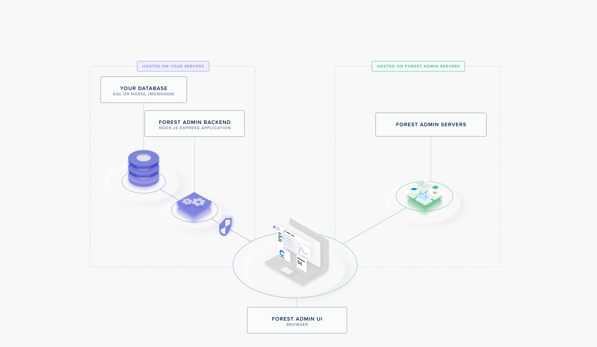
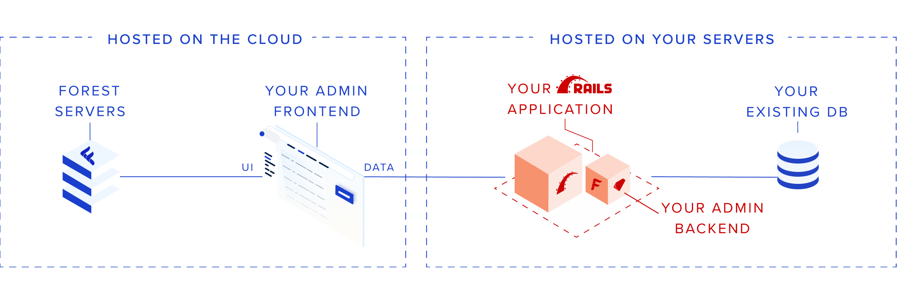
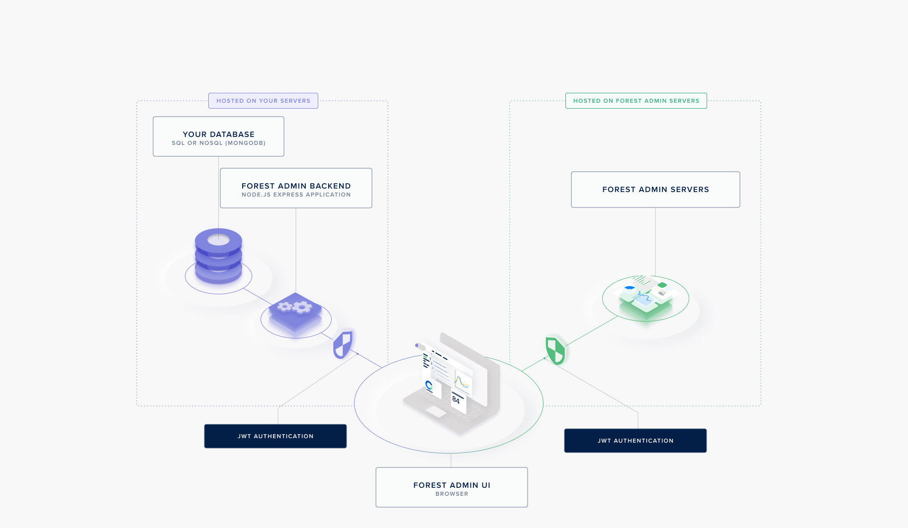
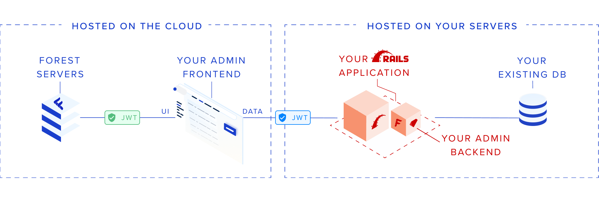
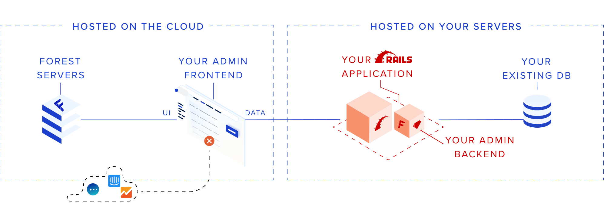
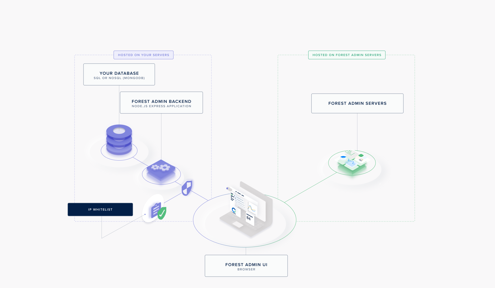
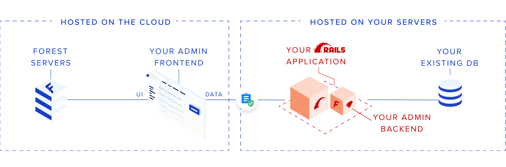

# How it works

Before you start writing a single line of code, it’s a good idea to get an overview of how Forest Admin works. The magic lies in its architecture.&#x20;

Forest Admin provides you with:

* An API hosted on your server to retrieve your data. We call it the **Admin Backend**
  * if you chose a database as a datasource (PostgreSQLL, MySQL, MSSQL, MongoDB), your Admin Backend will be generated as a **standalone folder**.
  * if you chose an existing app as a datasource (Rails, Django, Express/Sequelize, Express/Mongoose), your Admin Backend will be generated **within your app**.
* A user interface to access and manage your data from your browser. This **Forest Admin User Interface** is built and managed through ressources hosted on Forest Admin's servers.












For a more in-depth explanation of Forest Admin's architecture (the Node.JS agent version), please read the [following article](https://medium.com/forest-admin/a-deep-dive-into-forest-admins-architecture-and-its-benefits-for-the-developers-who-trust-it-1d49212fb4b).


## The Admin Backend

The Admin Backend is generated upon install and **hosted on your end**.

It includes an API allowing to **translate calls made from the Forest Admin UI into queries** to your database (covering actions such as CRUD, search & filters, pagination, sorting, etc.).

It also provides the Forest Admin servers with the information needed to build the User Interface (the **Forest Admin Schema**). This information includes table names, column names and types, and relationships. It is sent when you run your Admin Backend [within a file called `forestadmin-schema.json`](../models/#the-forestadmin-schema-json-file).

## Data Privacy

When logging into the **Forest Admin UI** in your browser, you will connect to:

1. The **Forest Admin servers** to retrieve the **Forest Admin UI.**
2. The **Admin Backend** to retrieve your **data** and populate the Forest Admin UI with it.


As your data transits directly from the Admin Backend hosted on your end and the user browser, **it never transits through our servers**.




.png>)







## Security

The connection to both servers to the **Admin Backend** and the **Forest Admin Servers** are protected using 2 different [**JWT**](https://jwt.io) signed by 2 different keys:

1. `FOREST_ENV_SECRET` to authenticate all requests made to the **Forest Admin Servers**
2. `FOREST_AUTH_SECRET` to authenticate all requests made to the **Admin Backend**












`FOREST_ENV_SECRET` is provided by Forest Admin and ensures your **Admin Backend** interacts with the relevant environment configuration on our end**.**

`FOREST_AUTH_SECRET` is chosen freely by you and is never disclosed to anyone**.**



The JWT Data Token contains all the details of the requesting user. On any authenticated request to your Admin Backend, you can access them with the variable `req.user`.


```javascript
{
  "id": "172",
  "email": "angelicabengtsson@doha2019.com",
  "firstName": "Angelica",
  "lastName": "Bengtsson",
  "team": "Pole Vault",
  "role": "Manager",
  "tags": [{ key: "country", value: "Canada" }],
  "renderingId": "4998",
  "iat": 1569913709,
  "exp": 1571123309
}
```




### **No 3rd-party Tracking**

The **Forest Admin UI** has an option to completely disable any 3rd-party provider that could track data available from your browser to guarantee the respect of data privacy.











### IP Whitelisting

The [IP whitelisting](broken-reference) feature allows you to create a list of trusted IP addresses or IP ranges from which your admin users can both access to the **Forest Admin UI** and interact with your **Admin Backend**.











### **DMZ & VPN**

You're free to host your **Admin Backend** in the cloud architecture you want to be compliant with your security infrastructure (DMZ, VPN, etc.).

.png>)

## Credentials

We’re already working with companies compliant with the following Industry Standard Certifications.

.png>)

