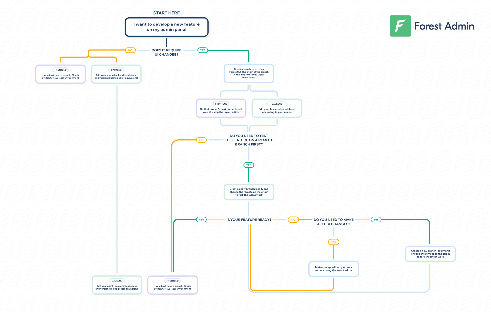


Please be sure of your agent type and version and pick the right documentation accordingly.





This is the documentation of the `forest-express-sequelize` and `forest-express-mongoose` Node.js agents that will soon reach end-of-support.

`forest-express-sequelize` v9 and `forest-express-mongoose` v9 are replaced by [`@forestadmin/agent`](https://docs.forestadmin.com/developer-guide-agents-nodejs/) v1.

Please check your agent type and version and read on or switch to the right documentation.





This is still the latest Ruby on Rails documentation of the `forest_liana` agent, you’re at the right place, please read on.





This is the documentation of the `django-forestadmin` Django agent that will soon reach end-of-support.

If you’re using a Django agent, notice that `django-forestadmin` v1 is replaced by [`forestadmin-agent-django`](https://docs.forestadmin.com/developer-guide-agents-python) v1.

If you’re using a Flask agent, go to the [`forestadmin-agent-flask`](https://docs.forestadmin.com/developer-guide-agents-python) v1 documentation.

Please check your agent type and version and read on or switch to the right documentation.





This is the documentation of the `forestadmin/laravel-forestadmin` Laravel agent that will soon reach end-of-support.

If you’re using a Laravel agent, notice that `forestadmin/laravel-forestadmin` v1 is replaced by [`forestadmin/laravel-forestadmin`](https://docs.forestadmin.com/developer-guide-agents-php) v3.

If you’re using a Symfony agent, go to the [`forestadmin/symfony-forestadmin`](https://docs.forestadmin.com/developer-guide-agents-php) v1 documentation.

Please check your agent type and version and read on or switch to the right documentation.




# Developing on Forest Admin

One of the goals of Forest Admin is empowering technical teams to achieve more in less time: in other words, giving them the means to create and maintain a great admin panel in as little time as possible.

### Development tools

Your Forest Admin panel is composed of 2 parts - [the frontend (UI) and the backend](../) - and for each one you need the right tools:

The **Admin** **backend** is part of your codebase. As a result, you'll be using your own favorite tools to customize it:&#x20;

- Editing: your favorite IDE
- Versioning: your favorite versioning tool (git, svn, mercurial, etc)

Your **Forest Admin UI** is **not** part of your codebase: it is managed on Forest Admin servers. As a result, you depend on Forest Admin tools to customize it. Here's what we've built for you:

- Editing: use the [Layout Editor mode](https://docs.forestadmin.com/user-guide/getting-started/master-your-ui/using-the-layout-editor-mode) to intuitively manage your layout (UI)
- Versioning: use [Forest CLI](forest-cli-commands/) to seamlessly manage your layout versions

### Development workflow

For a simple and hands-on **example** of how to develop on Forest Admin according to our recommended development workflow, see [this page](../../../getting-started/development-workflow.md).

For a more complete view showcasing each possible scenario of the recommended development workflow, we've drawn the following state **diagram**:

<figure><figcaption></figcaption></figure>

In the next pages, we'll cover each step in details.
