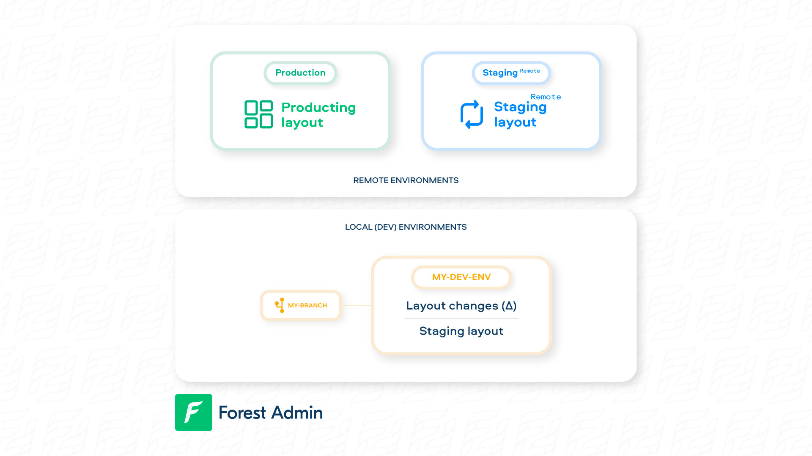
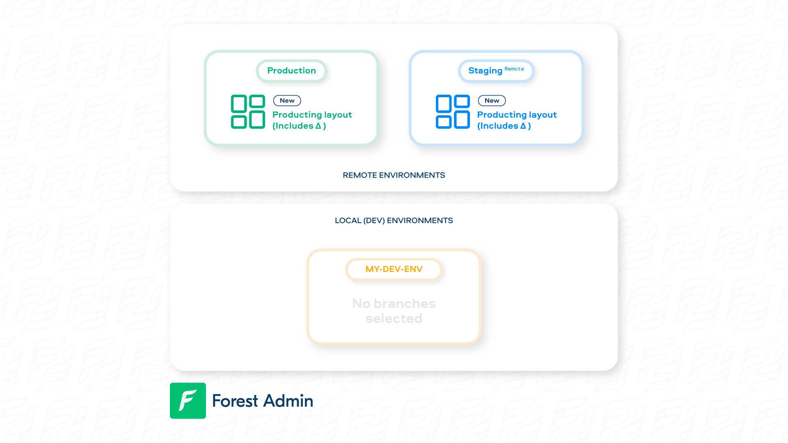
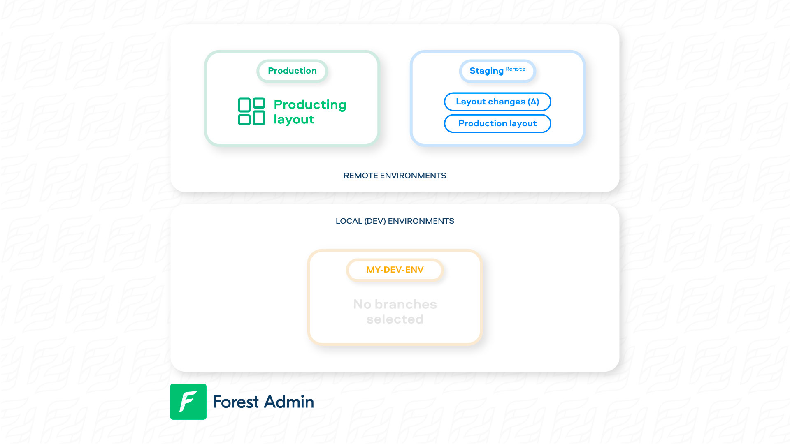
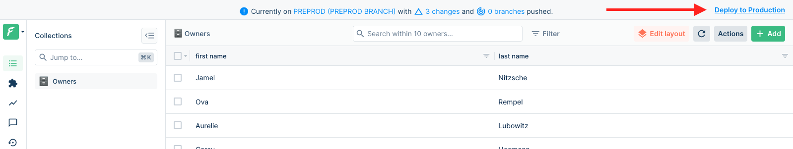
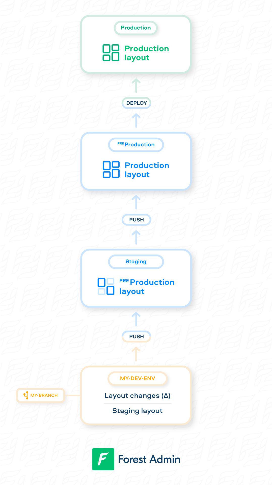


Please be sure of your agent type and version and pick the right documentation accordingly.





This is the documentation of the `forest-express-sequelize` and `forest-express-mongoose` Node.js agents that will soon reach end-of-support.

`forest-express-sequelize` v9 and `forest-express-mongoose` v9 are replaced by [`@forestadmin/agent`](https://docs.forestadmin.com/developer-guide-agents-nodejs/) v1.

Please check your agent type and version and read on or switch to the right documentation.





This is still the latest Ruby on Rails documentation of the `forest_liana` agent, you’re at the right place, please read on.





This is the documentation of the `django-forestadmin` Django agent that will soon reach end-of-support.

If you’re using a Django agent, notice that `django-forestadmin` v1 is replaced by [`forestadmin-agent-django`](https://docs.forestadmin.com/developer-guide-agents-python) v1.

If you’re using a Flask agent, go to the [`forestadmin-agent-flask`](https://docs.forestadmin.com/developer-guide-agents-python) v1 documentation.

Please check your agent type and version and read on or switch to the right documentation.





This is the documentation of the `forestadmin/laravel-forestadmin` Laravel agent that will soon reach end-of-support.

If you’re using a Laravel agent, notice that `forestadmin/laravel-forestadmin` v1 is replaced by [`forestadmin/laravel-forestadmin`](https://docs.forestadmin.com/developer-guide-agents-php) v3.

If you’re using a Symfony agent, go to the [`forestadmin/symfony-forestadmin`](https://docs.forestadmin.com/developer-guide-agents-php) v1 documentation.

Please check your agent type and version and read on or switch to the right documentation.




# Deploying your changes

You're building a great feature which requires tweaking your layout (UI), you've used the Layout Editor and it looks just like you had imagined? Well now is the time to try it on a remote server!

Imagine this is your current situation:

<figure><figcaption></figcaption></figure>

This would be the case if you chose "Staging" as the origin of your branch when you first created it. You have then made **layout changes (Δ)** over it.

### Applying your changes to production: `deploy`

`deploy` means applying your branch's changes to your reference environment definitively.&#x20;


The **reference** environment is the one at the very end of your development flow: it is the one with your production data and it is the one that will be updated when you use the `deploy` command.



As all your environments' layouts depend on your **reference** environment, the `deploy` command will apply the layout changes to all your project environments. Deploy with care as such action **cannot be reverted**.


To achieve this, you'll be using Forest CLI's [deploy](forest-cli-commands/deploy.md) command from an environment **that has your reference environment as its origin**:

```
forest deploy
```

The end result is the following:

<figure><figcaption></figcaption></figure>


If you want to deploy from an environment whose origin is not your reference environment, you'll need to use the [set-origin](forest-cli-commands/set-origin.md) environment first so you can make it its origin.



Don't forget to **deploy your backend changes** as well (if any), as showcased on [this flowchart](./#development-workflow).


### Testing your changes on a remote (i.e "staging"): `push`

Say, before you deployed to Production, you wanted to test your charges on a staging first.

`push` means moving your branch's changes to a remote environment set as origin of your branch. To achieve this, you'll be using Forest CLI's [push](forest-cli-commands/push.md) command:

```
forest push
```

Note that you'll be pushing your **current** branch. To select another branch, use [switch](forest-cli-commands/switch.md). If the origin of your branch is not the remote you want (ie: staging) change it with [set-origin](forest-cli-commands/set-origin.md)


As your company grows, so does your development flow: you may want a more complex architecture where you have more than one layer of test environments before production (i.e preprod). This is definitely possible using Forest CLI and the right environment settings, see [here](../environments.md#change-environment-origin).


####

<figure><figcaption></figcaption></figure>

#### Deploying from your remote's interface

Once you have tested your new feature on "Remote 1", you can't deploy your branch's layout to "Production", since your branch will have been deleted by pushing it to "Remote 1".

To deploy it from there, simply **click on "Deploy to production" in the top banner**!



#### Making changes directly from the remote

Imagine you've pushed your branch onto your remote, but notice a slight change is still required in the layout. Then, simply use the Layout Editor from your remote! It'll play nicely with your branch's layout changes: any changes you make on your remote will also be deployed when you run `forest deploy`.

You can also create a new branch with your remote environment as origin and do the same process explained above.

### Summary

The below image showcases an example of a development flow with 2 layers of test environments (staging, then pre-production).

Notice how the `deploy` command is used only at the last step, to move the layout changes to the reference environment (i.e "Production" in this case)&#x20;

<figure><figcaption></figcaption></figure>
