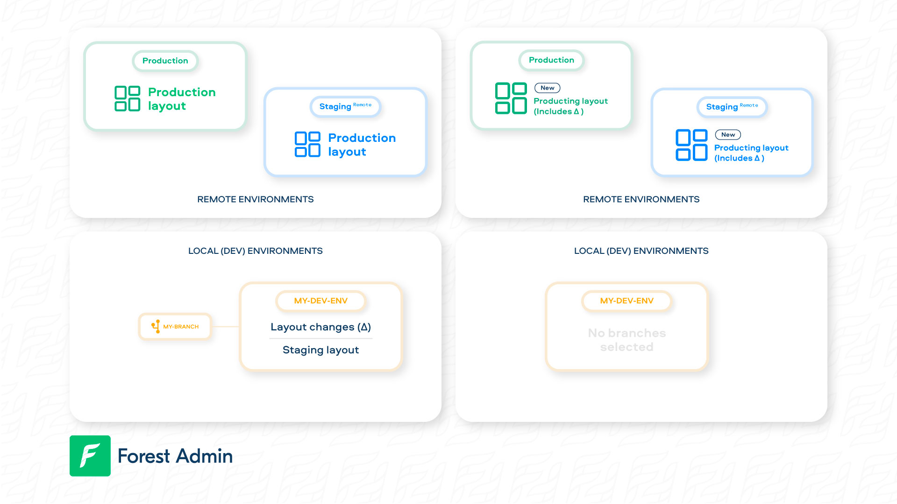
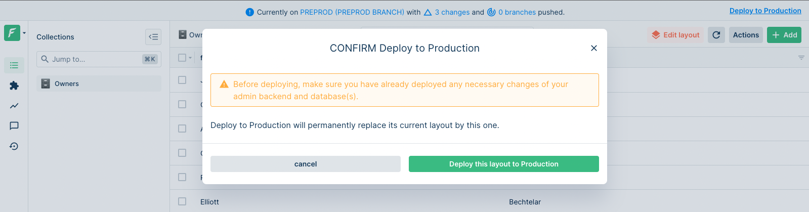


Please be sure of your agent type and version and pick the right documentation accordingly.





This is the documentation of the `forest-express-sequelize` and `forest-express-mongoose` Node.js agents that will soon reach end-of-support.

`forest-express-sequelize` v9 and `forest-express-mongoose` v9 are replaced by [`@forestadmin/agent`](https://docs.forestadmin.com/developer-guide-agents-nodejs/) v1.

Please check your agent type and version and read on or switch to the right documentation.





This is still the latest Ruby on Rails documentation of the `forest_liana` agent, you’re at the right place, please read on.





This is the documentation of the `django-forestadmin` Django agent that will soon reach end-of-support.

If you’re using a Django agent, notice that `django-forestadmin` v1 is replaced by [`forestadmin-agent-django`](https://docs.forestadmin.com/developer-guide-agents-python) v1.

If you’re using a Flask agent, go to the [`forestadmin-agent-flask`](https://docs.forestadmin.com/developer-guide-agents-python) v1 documentation.

Please check your agent type and version and read on or switch to the right documentation.





This is the documentation of the `forestadmin/laravel-forestadmin` Laravel agent that will soon reach end-of-support.

If you’re using a Laravel agent, notice that `forestadmin/laravel-forestadmin` v1 is replaced by [`forestadmin/laravel-forestadmin`](https://docs.forestadmin.com/developer-guide-agents-php) v3.

If you’re using a Symfony agent, go to the [`forestadmin/symfony-forestadmin`](https://docs.forestadmin.com/developer-guide-agents-php) v1 documentation.

Please check your agent type and version and read on or switch to the right documentation.




# deploy

The `forest deploy` command enables you to apply some layout changes to your [reference](../using-branches.md#what-is-a-branch) environment.

```
$ forest deploy --help

Deploy layout changes of the current branch to the reference one.

USAGE
  forest deploy

OPTIONS
  --force                  Skip confirmations.
  --help                   Display usage information.
```

### Deploying your changes

It is paramount to understand this command before using it:

<figure><figcaption></figcaption></figure>

As you can see in the above figure, the layout changes (Δ) located in your local branch `my-branch` will be **irreversibly applied** to your Production layout. Since your remotes' layout are based on your production's layout, the changes will appear there too.

To deploy, simply run `forest deploy`:

```
$ forest deploy
```


To be able to deploy the origin of the branch should be the reference environment (eg: production)


### Deploy from the UI

This is possible **only from a remote** which have the reference environment as origin:



To deploy your latest layout changes from a remote environment, you may use the **top banner link**: "Deploy to ...".
