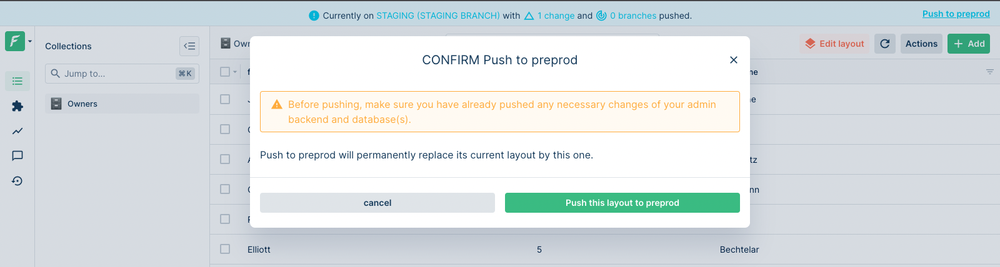


Please be sure of your agent type and version and pick the right documentation accordingly.





This is the documentation of the `forest-express-sequelize` and `forest-express-mongoose` Node.js agents that will soon reach end-of-support.

`forest-express-sequelize` v9 and `forest-express-mongoose` v9 are replaced by [`@forestadmin/agent`](https://docs.forestadmin.com/developer-guide-agents-nodejs/) v1.

Please check your agent type and version and read on or switch to the right documentation.





This is still the latest Ruby on Rails documentation of the `forest_liana` agent, you’re at the right place, please read on.





This is the documentation of the `django-forestadmin` Django agent that will soon reach end-of-support.

If you’re using a Django agent, notice that `django-forestadmin` v1 is replaced by [`forestadmin-agent-django`](https://docs.forestadmin.com/developer-guide-agents-python) v1.

If you’re using a Flask agent, go to the [`forestadmin-agent-flask`](https://docs.forestadmin.com/developer-guide-agents-python) v1 documentation.

Please check your agent type and version and read on or switch to the right documentation.





This is the documentation of the `forestadmin/laravel-forestadmin` Laravel agent that will soon reach end-of-support.

If you’re using a Laravel agent, notice that `forestadmin/laravel-forestadmin` v1 is replaced by [`forestadmin/laravel-forestadmin`](https://docs.forestadmin.com/developer-guide-agents-php) v3.

If you’re using a Symfony agent, go to the [`forestadmin/symfony-forestadmin`](https://docs.forestadmin.com/developer-guide-agents-php) v1 documentation.

Please check your agent type and version and read on or switch to the right documentation.




# push

The `forest push` command enables you to apply your local changes to a remote **non-reference** environment: for instance, pushing to your staging environment will result in your latest local layout changes being visible on your staging.

```
$ forest push --help
Push layout changes of your current branch to the branch origin.

USAGE
  $ forest push

OPTIONS
  --projectId=projectId          The id of the project to work on.
  --force                        Skip push changes confirmation.
  --help                         Display usage information.
```

### Pushing to a remote environment

It is paramount to understand this command before using it:

<figure><figcaption></figcaption></figure>

Pushing a branch to a remote means applying your latest layout changes to your origin environment. In the above figure, your layout changes (Δ) will be moved from `my-branch` to `Staging`.


Pushing your changes from your local branch will automatically **delete** it.


To push layout changes to your origin:

```
$ forest push
```

You will be prompted for confirmation before pushing:

```
$ forest push
[? Push branch my-current-branch onto Remote2 (Y|n): Y
```


To skip that confirmation, use the `--force` option.


### Push from the UI

This is possible **only from a remote** which `not` have the reference environment as origin:



To push your latest layout changes from a remote environment, you may use the **top banner link**: "Push to ...".

### Difference between forest push and forest deploy


Don't confuse `forest push` and `forest deploy`


- `forest push` applies the latest layout changes of that branch or environment to a non-reference environment
- `forest deploy` applies your latest layout changes **definitively** to your reference environment (i.e production)


You cannot `push` to production, because anything added on Production should be definitive. Therefore you can only `deploy` to Production.

