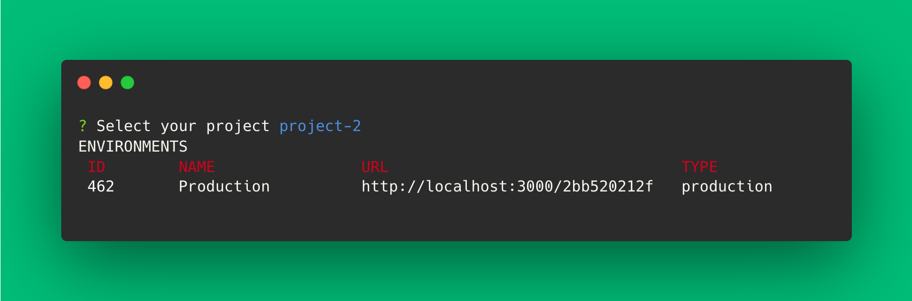
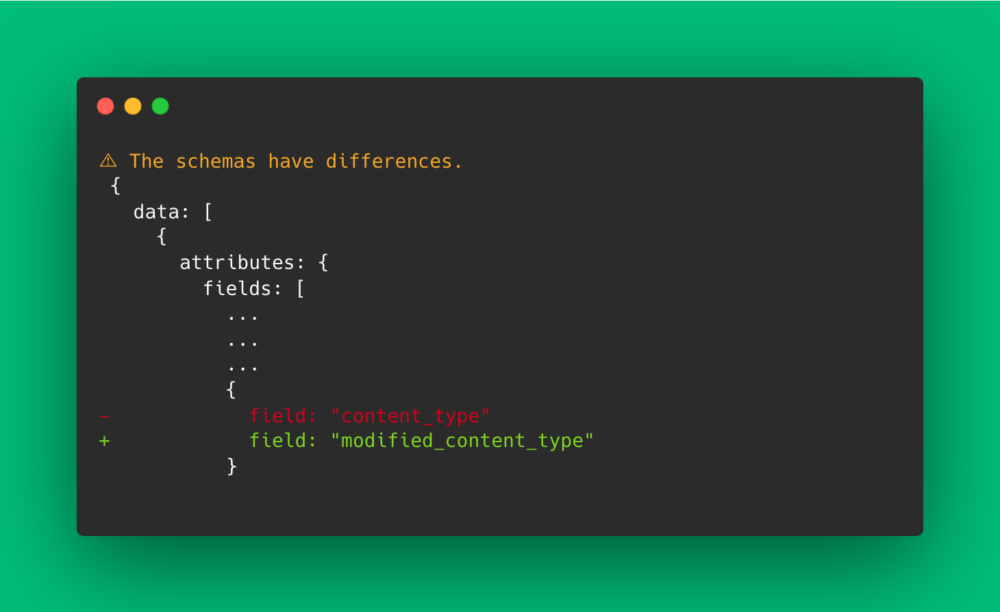

# schema:diff \[beta]

## What is this about?

It was brought to our attention that conflicts with schemas might occur when trying to push layout changes. To make the process easier for our customers and the support team, we have implemented a new feature that allows users to compare two schemas on two different environments with a simple command.

## The command

`forest schema:diff [ID env1] [ID env2]` will help you figure out whether there's a difference that, if not addressed, will make you run into issues down the line.&#x20;

In order to run it, there are a few steps to follow, as shown below.&#x20;

## Instructions

### Step 1: obtain environments' IDs

To compare two schemas, you will obviously need the IDs of the two environments you want to compare. To retrieve these IDs, run the following command:

```bash
forest environments
```

You must select your project like shown below.

<figure><figcaption></figcaption></figure>

We have chosen `project-2`

<figure><figcaption></figcaption></figure>

### Step 2: compare schemas

Once you have retrieved the environment IDs, `schema:diff` takes both as parameters – so you can use the following command to compare the schemas:

```
forest schema:diff [environment ID 1] [environment ID 2]
```

For example, if you want to compare environments with IDs 367 and 368, you would run the following command:

```
forest schema:diff 367 368
```

### Step 3: interpret results

If the schemas are different, you will see a list of the differences between the two schemas. If the schemas are identical, you will see a message indicating that the schemas are the same.

If there is a difference:

<figure><figcaption></figcaption></figure>

Or, if there is no difference:

<figure><figcaption></figcaption></figure>

### Bonus: Help command

If you need help using the schema:diff command, you can access the help information by running the following command:

```
forest schema:diff --help
```

## Future iterations

This being a Beta version, we will continue to improve this solution as time goes on – and also as we receive relevant feedback that can better guide us to meet our customers' needs.

### Wizard/Prompt

In the next iteration, we plan to add a wizard or prompt to the `schema:diff` command. This will make it easier for customers to select the right environment without having to retrieve the environment list first.

### Improved error message

Finally, in the last iteration, we plan to improve the error message that customers receive when they encounter the following error:&#x20;

`Error: Failed to push branch: source and destination environments must have the same schema`.&#x20;

The schema:diff result will be included in the error message to make it easier for customers to understand the issue and resolve it.
