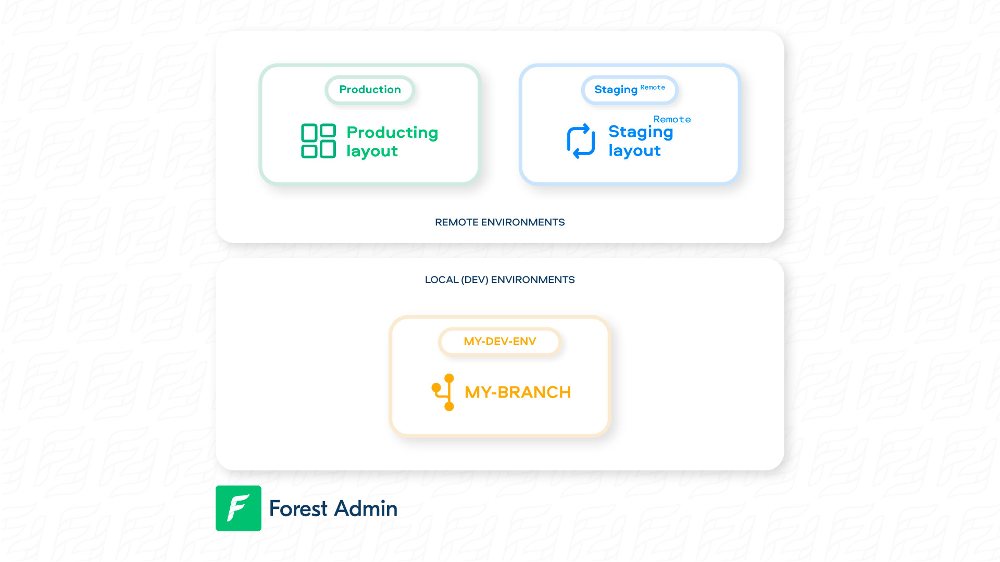
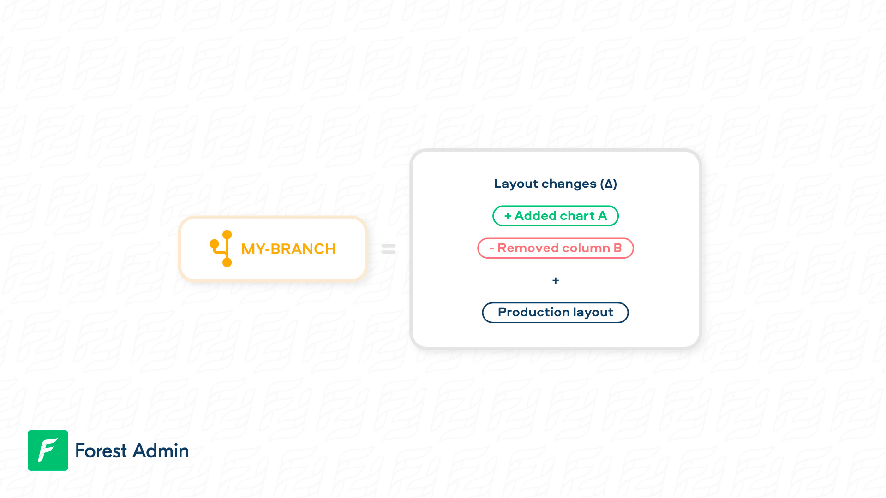
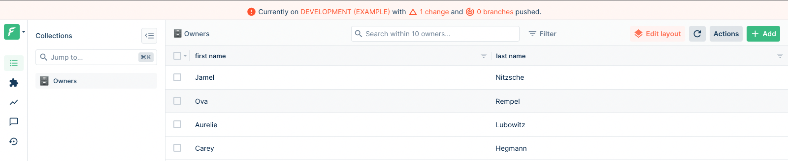


Please be sure of your agent type and version and pick the right documentation accordingly.





This is the documentation of the `forest-express-sequelize` and `forest-express-mongoose` Node.js agents that will soon reach end-of-support.

`forest-express-sequelize` v9 and `forest-express-mongoose` v9 are replaced by [`@forestadmin/agent`](https://docs.forestadmin.com/developer-guide-agents-nodejs/) v1.

Please check your agent type and version and read on or switch to the right documentation.





This is still the latest Ruby on Rails documentation of the `forest_liana` agent, you’re at the right place, please read on.





This is the documentation of the `django-forestadmin` Django agent that will soon reach end-of-support.

If you’re using a Django agent, notice that `django-forestadmin` v1 is replaced by [`forestadmin-agent-django`](https://docs.forestadmin.com/developer-guide-agents-python) v1.

If you’re using a Flask agent, go to the [`forestadmin-agent-flask`](https://docs.forestadmin.com/developer-guide-agents-python) v1 documentation.

Please check your agent type and version and read on or switch to the right documentation.





This is the documentation of the `forestadmin/laravel-forestadmin` Laravel agent that will soon reach end-of-support.

If you’re using a Laravel agent, notice that `forestadmin/laravel-forestadmin` v1 is replaced by [`forestadmin/laravel-forestadmin`](https://docs.forestadmin.com/developer-guide-agents-php) v3.

If you’re using a Symfony agent, go to the [`forestadmin/symfony-forestadmin`](https://docs.forestadmin.com/developer-guide-agents-php) v1 documentation.

Please check your agent type and version and read on or switch to the right documentation.




# Using branches

As we've explained in the previous page, your Admin panel's frontend is saved on Forest Admin servers. As a result, you can't version it. But don't worry, we've got you covered with some great tools!

### What is a layout?

The notion of branch cannot be explained without first explaining what a _layout_ is.

A **layout** is all the settings that **define your user interface (UI)**. In Forest Admin, there is 1 layout per environment and per team:

<figure><figcaption></figcaption></figure>


To manipulate your layouts, you will be using [Forest CLI](forest-cli-commands/).


### What is a branch?

A branch is a fork (i.e copy) of the layout of its _origin_ environment. It is attached to your development environment.


The **origin** of a branch is either specified using the `--origin` option or selected when prompted otherwise). You should choose the environment you want to make some layout changes on.


Once you've created a branch, your layout will look exactly like the layout of its origin environment.

### How do branches work?

Any **layout change** you make on your current branch using the [Layout Editor](https://docs.forestadmin.com/user-guide/getting-started/master-your-ui/using-the-layout-editor-mode) will be **saved on your current branch** and will not affect its origin environment.

Imagine the following situation where you have 3 environments:

<figure><figcaption></figcaption></figure>

The branch `my-branch` is based on the production layout. Any changes made on it are saved in your branch's layout and can later be [applied ](forest-cli-commands/deploy.md)on it.

<figure><figcaption></figcaption></figure>


This also means that any changes made to the origin of your branch will instantly reflect on your branch.\
\
For those familiar with git's _rebase_, this means you will **never have to** **rebase** your branch on its origin.


### How do you create a branch?

To create a branch, you'll need to use [Forest CLI](forest-cli-commands/). Make sure you've created your local development environment using the [init](forest-cli-commands/init.md) command. Then, to create a branch named `my-branch` based on your `production` environment, simply run:

```
forest branch my-branch --origin production
```


Using kebab-case is recommended; however, should you want to use spaces in your branch name, don't forget to surround it with quotes, like so `forest branch "my branch" --origin ...`.


To learn more about the `branch` command, please visit [this page](forest-cli-commands/branch.md).

### Checking your branch information

On your interface, you can check at all times what branch you are on and how many layout changes were made: they appear in the top banner. The `X branches pushed` information is relevant for remote environments only: it shows how many branches were already pushed onto it.




To switch your _current_ branch to another existing branch, check out the [switch](forest-cli-commands/switch.md) command.


Now that you've mastered branch creation and management, let's dive into the next step of the development workflow: deployment
