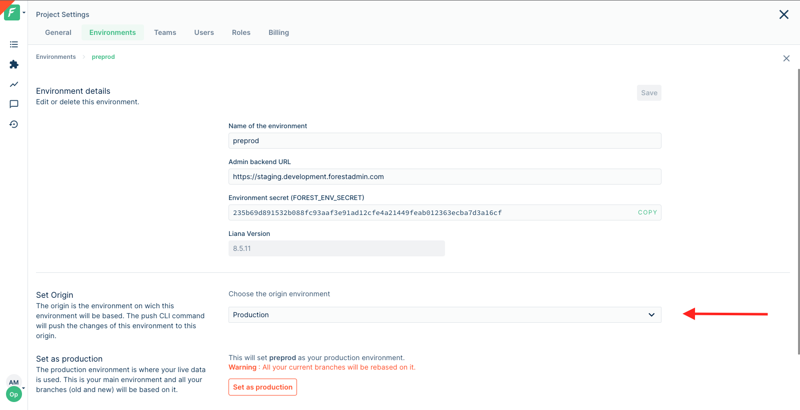


Please be sure of your agent type and version and pick the right documentation accordingly.





This is the documentation of the `forest-express-sequelize` and `forest-express-mongoose` Node.js agents that will soon reach end-of-support.

`forest-express-sequelize` v9 and `forest-express-mongoose` v9 are replaced by [`@forestadmin/agent`](https://docs.forestadmin.com/developer-guide-agents-nodejs/) v1.

Please check your agent type and version and read on or switch to the right documentation.





This is still the latest Ruby on Rails documentation of the `forest_liana` agent, you’re at the right place, please read on.





This is the documentation of the `django-forestadmin` Django agent that will soon reach end-of-support.

If you’re using a Django agent, notice that `django-forestadmin` v1 is replaced by [`forestadmin-agent-django`](https://docs.forestadmin.com/developer-guide-agents-python) v1.

If you’re using a Flask agent, go to the [`forestadmin-agent-flask`](https://docs.forestadmin.com/developer-guide-agents-python) v1 documentation.

Please check your agent type and version and read on or switch to the right documentation.





This is the documentation of the `forestadmin/laravel-forestadmin` Laravel agent that will soon reach end-of-support.

If you’re using a Laravel agent, notice that `forestadmin/laravel-forestadmin` v1 is replaced by [`forestadmin/laravel-forestadmin`](https://docs.forestadmin.com/developer-guide-agents-php) v3.

If you’re using a Symfony agent, go to the [`forestadmin/symfony-forestadmin`](https://docs.forestadmin.com/developer-guide-agents-php) v1 documentation.

Please check your agent type and version and read on or switch to the right documentation.




# Environments

After you install for the first time, a local **development** environment is created for you, with a temporary `pre-deploy-to-production` branch (more on _branches_ later).

Your first objective should be to deploy to **production**.

### Deploying to Production

Forest Admin is meant to help you manage your operations: this can only happen if you work with your Production data! To do so, you need to **create your Production environment**.

Click "Deploy to production" on the top banner or in the _Environments_ tab of your Project settings.

#### Deploy your admin backend

On the first step, you need to input your admin backend's URL. This is the URL of the server onto which you have deployed (or will soon deploy) your admin backend's code base:


If you need help deploying your admin backend's codebase, here are 2 step-by-step guides showing how it can be done [on Heroku](../../how-tos/setup/deploy-to-production-on-heroku.md) or [on a standard ubuntu server](broken-reference).


.png>)


Note that for **security reasons**, your admin backend must use the **HTTPS** protocol.



The URL must not end with a trailing `/`.


#### Connect to your database

On the next step, you need to fill out your Production database credentials:

.png>)


Your **database credentials** never leave your browser and are solely used to generate environment variables on the next step, so they are **never exposed**.


#### Set your environment variables

The final step requires that you add environment variables to your server. Follow on-screen instructions:

.png>)

Once your node server is successfully detected and running with the indicated environment variables, a "Finish" button will appear. Click on it to finalize the creation of your Production environment.

### Creating a remote environment

Now that your admin panel is live in production, you might want to add an extra step for testing purposes. Forest Admin allows you to create remote (a.k.a **staging**) environments.

To create a new remote environment, go to your Project settings **(1)**:

Then from the _Environments_ tab, click on "Add a new environment" **(2)**.

.png>)


You can choose to deploy to a remote (staging) environment **before** going to production (see below), it's up to you.


.png>)

#### Choose your environment name

You'll first be asked to input the name of the remote environment you wish to create:

.png>)

#### Enter your admin backend's URL for that environment

Deploy your admin backend to your new server - your staging server for instance - then input its URL:

.png>)

#### Connect to your database

You need a separate database for this new environment: if you're creating a _Staging_, then it must be your _staging_ data, so your _staging_ database!

.png>)


Your **database credentials** never leave your browser and are solely used to generate environment variables on the next step, so they are **never exposed**.


#### Set your environment variables

The final step requires that you add environment variables to your server. Follow on-screen instructions:

.png>)

Once your node server is successfully detected and running with the indicated environment variables, a **Finish** button will appear. Click on it to finalize the creation of your new remote environment.

### Change environment origin

You can change the origins of your environments to create complex workflows - for instance dev > staging > preprod > production. All the layout of an environment will be generated based on its parent's layout.

To do so, click on the environment you wish to change the origin of and from its details page, select the desired origin in the _Set Origin_ section.


All child environment will be refreshed based on the new architectures.


### Set an environment as production

A standard project usually has a production and at least a staging environment, but you may be using other remote environments. At some point you may feel the need to set another environment as your production environment (a.k.a reference).


To set as production an environment it should have as origin the actual reference.


To do so, click on the environment you wish to set as production and from its details page, click "Set as production".


The actual reference will take the new production as origin. All children layout will be refreshed. Any layout change that is not applicable will be ignored.


### Delete an environment

You may also delete an environment. **Be very careful** as there is no going back!
