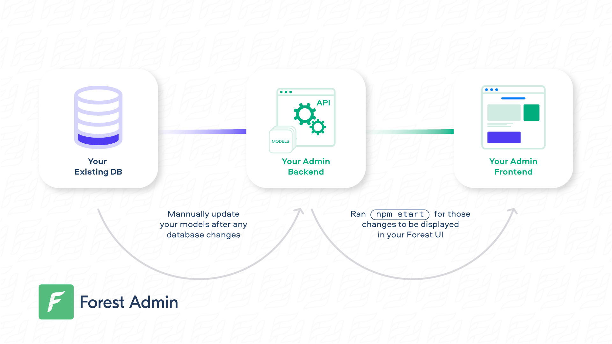


Please be sure of your agent type and version and pick the right documentation accordingly.





This is the documentation of the `forest-express-sequelize` and `forest-express-mongoose` Node.js agents that will soon reach end-of-support.

`forest-express-sequelize` v9 and `forest-express-mongoose` v9 are replaced by [`@forestadmin/agent`](https://docs.forestadmin.com/developer-guide-agents-nodejs/) v1.

Please check your agent type and version and read on or switch to the right documentation.





This is still the latest Ruby on Rails documentation of the `forest_liana` agent, you’re at the right place, please read on.





This is the documentation of the `django-forestadmin` Django agent that will soon reach end-of-support.

If you’re using a Django agent, notice that `django-forestadmin` v1 is replaced by [`forestadmin-agent-django`](https://docs.forestadmin.com/developer-guide-agents-python) v1.

If you’re using a Flask agent, go to the [`forestadmin-agent-flask`](https://docs.forestadmin.com/developer-guide-agents-python) v1 documentation.

Please check your agent type and version and read on or switch to the right documentation.





This is the documentation of the `forestadmin/laravel-forestadmin` Laravel agent that will soon reach end-of-support.

If you’re using a Laravel agent, notice that `forestadmin/laravel-forestadmin` v1 is replaced by [`forestadmin/laravel-forestadmin`](https://docs.forestadmin.com/developer-guide-agents-php) v3.

If you’re using a Symfony agent, go to the [`forestadmin/symfony-forestadmin`](https://docs.forestadmin.com/developer-guide-agents-php) v1 documentation.

Please check your agent type and version and read on or switch to the right documentation.




# Models

Your models are located in `/models`. They control a big part of your Forest UI.

### Reflecting your database changes in your UI

When you install for the first time, Lumber introspects your database and generates your models accordingly.

Afterwards, here's how your database changes can be rendered in your Forest UI:

<figure><figcaption></figcaption></figure>

### Updating your models automatically

If you made many changes or even added a new table/collection, we recently reintroduced a programmatic way to help you manage the associated file changes:


This feature requires an agent **version** 7 or higher.


Version 2.2+ of [Forest CLI](https://www.npmjs.com/package/forest-cli) allows you via its `schema:update` command to:

- Generate files which, after introspecting your database, appear to be missing in your folders (`models` , `routes` & `forest`). Eg. Adding a new table and launching `schema:update` within your project directory should generate the associated models/routes & forest files
- Generate a correct project architecture to easily manage multiple databases. After your onboarding (on a single database), update the `config/databases.js` file to add a new connection, launch `schema:update` and your models should be set correctly


`forest schema:update` will **never** modify your code base (remove files, move files, change file content). It's up to you to copy some (or all) of the generated contents into your existing files/folders.


Note that `forest schema:update` options are as follows:

- `-c` or `--config` , allowing to specify a path for the config file to user (Default to `./config/databases.js`)
- `-o` or `--output-directory` : Create a directory named after the config parameter provided. It will also redump all the `models/routes/forest` file in a specific directory, allowing the end-user to pick code modification.

This command need to be launched at the root of the project directory, where the `.env` should be, since it is required by `config/databases.js` file.&#x20;


Have any models that will always stay hidden? Find out how [you can exclude them](../../how-tos/settings/include-exclude-models.md) and gain on performance.


### Enriching your models

Lumber does some of the work for you. However, **you remain in control of your models**.

On the following page, we'll cover how you can enrich your models:


[enrich-your-models.md](enrich-your-models.md)


### The `.forestadmin-schema.json` file

On server start, a `.forestadmin-schema.json` file will be auto-generated in **local (development) environments only.** It reflects:&#x20;

- the **state of your models** (in `/models`)**.**
- your **Forest Admin customization** (in `/forest`).


This file **must be versioned and deployed** for any remote environment (staging, production, etc.), as it will be used to generate your Forest UI.



We use the environment variable _**NODE_ENV**_ to detect if an environment is in development. Setting this variable to either nothing or _**development**_ will regenerate a new _.forestadmin-schema.json_ file every time your app restarts. Using another value will not regenerate the file.



A consequence of the above is, **in Production** the `.forestadmin-schema.json` file does **not** update according to your schema changes.



**Do not edit this file,** as it could break your interface if the wrong syntax is used.


Versioning the`.forestadmin-schema.json` file will also help you visualize your changes:


To **disable automatic** Forest Admin schema updates and do it **manually**, follow this [how-to](https://docs.forestadmin.com/documentation/v/v4/how-tos/disable-automatic-forest-admin-schema-update).

