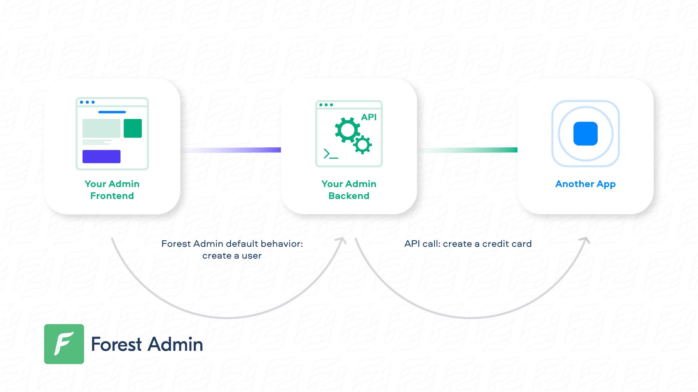
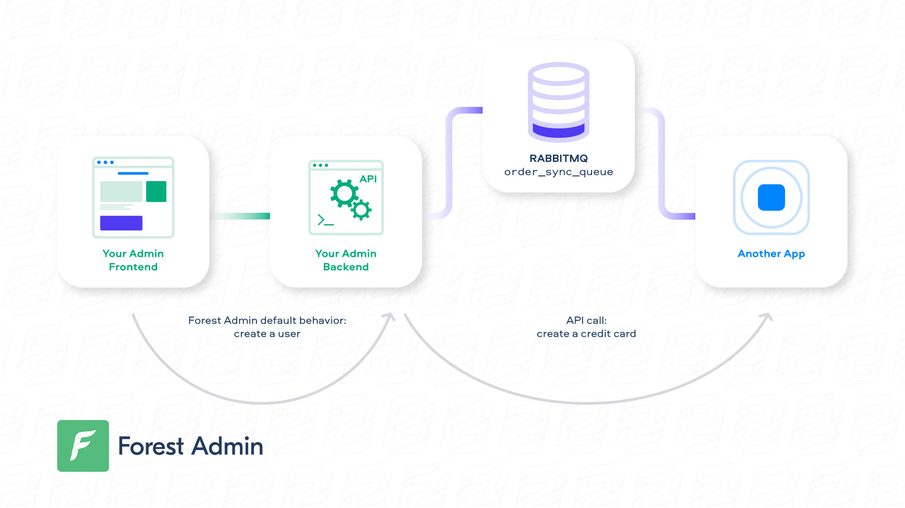

# Extend a route

Extending a route is a clean way to achieve more by building on top of Forest Admin's existing routes.

To extend a route, simply **add** **your own logic before the `next()` statement:**




```javascript
const express = require('express');
const { PermissionMiddlewareCreator } = require('forest-express-sequelize');

const router = express.Router();
const permissionMiddlewareCreator = new PermissionMiddlewareCreator('companies');

...

// Create a Action Approval - Check out our documentation for more details: https://docs.forestadmin.com/documentation/reference-guide/routes/default-routes#create-a-record
router.post('/companies', permissionMiddlewareCreator.create(), (req, res, next) => {
  // >> Add your logic here <<
  next();
});

...

module.exports = router;
```





```javascript
const express = require('express');
const { PermissionMiddlewareCreator } = require('forest-express-mongoose');

const router = express.Router();
const permissionMiddlewareCreator = new PermissionMiddlewareCreator('companies');

...

// Create a Action Approval - Check out our documentation for more details: https://docs.forestadmin.com/documentation/reference-guide/routes/default-routes#create-a-record
router.post('/companies', permissionMiddlewareCreator.create(), (req, res, next) => {
  // >> Add your logic here <<
  next();
});

...

module.exports = router;
```




### Adding logic with an API call

The most simple way to trigger your business app's (or any external app's) logic is with an API call!

In the following example, we override the `CREATE` route so that a credit card is created whenever a new customer is created in Forest Admin:

<figure><figcaption></figcaption></figure>


```javascript
...

// Require superagent once you've installed it (npm install superagent)
const superagent = require('superagent');

...

router.post('/customers', permissionMiddlewareCreator.create(), (req, res, next) => {
  // Prepare the API call using the Forest Admin's posted data
  superagent
    .post('https://my-company/create-card')
    // Don't forget to authenticate your request using the relevant authentication method
    .set('X-API-Key', '**********')
    .end((err, res) => {
      // Call next() to execute Forest Admin's default behavior
      next();
    });
});

...

module.exports = router;
```


### Adding logic with a message broker

Using a message broker - such as RabbitMQ or Kafka - to broadcast events is current practice.

Here is how you could be using [RabbitMQ](https://www.rabbitmq.com/tutorials/tutorial-one-javascript.html) to handle `orders` synchronization across multiple channels:

<figure><figcaption></figcaption></figure>


```javascript
...

const amqp = require('amqplib/callback_api');

...

router.put('/orders/:orderId', permissionMiddlewareCreator.update(), (req, res, next) => {
    // Prepare your message from Forest Admin's updated data
	var orderId = req.body.data.id;
	var orderStatus = req.body.data.attributes.shipping_status;
	var message = 'Order ' + orderId + ' shipping status is now: ' + orderStatus;
	var queue = 'orders_sync_queue';

    // Connect to your Rabbitmq remote instance and publish your message
    amqp.connect('amqp://{your_rabbitmq_host}', function(error0, connection) {
	    if (error0) {
	        throw error0;
	    }
	    connection.createChannel(function(error1, channel) {
	        if (error1) {
	            throw error1;
	        }
	        channel.assertQueue(queue, {
	            durable: false
	        });
	        channel.sendToQueue(queue, Buffer.from(message));
	    });
	    setTimeout(function() {
	        connection.close();
	    }, 500);
	});
	
  // Call next() to execute Forest Admin's default behavior
  next();
});

...

module.exports = router;
```


### Adding logic after Forest Admin's default behavior

At some point, you may want to trigger your remote logic **after** Forest Admin's logic.

To achieve this, you can manually recreate `next()`'s behavior by using the snippets of [default routes](default-routes.md), then append your own logic.
